- [Important Information relating to Web Development](#important-information-relating-to-web-development)
  - [What is a Session?](#what-is-a-session)
  - [User Agent](#user-agent)
    - [User Agent string](#user-agent-string)
    - [State and Identity of User Agent](#state-and-identity-of-user-agent)
  - [Running a method in the Browser Console](#running-a-method-in-the-browser-console)
  - [Execution Environments in the case of Multiple Tabs](#execution-environments-in-the-case-of-multiple-tabs)
  - [Server-side vs. Client-side code](#server-side-vs-client-side-code)
  - [Dynamic vs. Static code](#dynamic-vs-static-code)
- [Data types in Javascript](#data-types-in-javascript)
  - [`string` data-type](#string-data-type)
    - [Creating a string from other datatypes](#creating-a-string-from-other-datatypes)
    - [Prototype and Static methods of the global `String` object](#prototype-and-static-methods-of-the-global-string-object)
    - [`String.prototype.includes()`](#stringprototypeincludes)
  - [`undefined` data type](#undefined-data-type)
  - [Objects](#objects)
    - [Converting an `Object` to `string` type using `toString()`](#converting-an-object-to-string-type-using-tostring)
    - [Displaying an `Object`](#displaying-an-object)
    - [Retrieving a reference to an `Object` from READ-ONLY properties of other objects](#retrieving-a-reference-to-an-object-from-read-only-properties-of-other-objects)
    - [Object Construction function](#object-construction-function)
    - [Primitive Wrapper Objects](#primitive-wrapper-objects)
      - [`Number` wrapper object](#number-wrapper-object)
  - [Arrays](#arrays)
    - [Structure of created array objects](#structure-of-created-array-objects)
    - [Accessing elements at specific indices of an array](#accessing-elements-at-specific-indices-of-an-array)
    - [What is an `Array`-like object?](#what-is-an-array-like-object)
    - [Some prototype/static methods of the global `Array` class](#some-prototypestatic-methods-of-the-global-array-class)
      - [`Array.prototype.forEach()`](#arrayprototypeforeach)
      - [Creating an array from other sequences using: `Array.from()`](#creating-an-array-from-other-sequences-using-arrayfrom)
- [Statements in Javascript](#statements-in-javascript)
  - [`throw` statement](#throw-statement)
  - [Understanding the behaviour of `for-of` loop statement](#understanding-the-behaviour-of-for-of-loop-statement)
- [Web APIs in Javascript](#web-apis-in-javascript)
  - [`Console` API](#console-api)
    - [`console.log(<arg>)` method](#consolelogarg-method)
    - [`console.trace()` method](#consoletrace-method)
    - [`console.warn(<arg>)` and `console.error(<arg>)` method](#consolewarnarg-and-consoleerrorarg-method)
    - [`console.time(<arg>)` and `console.timeEnd(<arg>)`](#consoletimearg-and-consoletimeendarg)
    - [`console.table(<arg>)` method](#consoletablearg-method)
    - [`console.clear()` method](#consoleclear-method)
  - [`Window` API](#window-api)
    - [Usage of `window.console` object](#usage-of-windowconsole-object)
    - [Useful properties of the `window` object](#useful-properties-of-the-window-object)
      - [`window.innerWidth`](#windowinnerwidth)
      - [`window.innerHeight`](#windowinnerheight)
      - [`window.scrollX`](#windowscrollx)
      - [`window.scrollY`](#windowscrolly)
    - [`window.document`](#windowdocument)
    - [Other methods of `window` object](#other-methods-of-window-object)
      - [`window.prompt()` or `prompt()`](#windowprompt-or-prompt)
      - [`window.confirm()` or `confirm()`](#windowconfirm-or-confirm)
      - [`window.alert(<arg>)` or `alert(<arg>)`](#windowalertarg-or-alertarg)
  - [`History` API](#history-api)
    - [`window.history.length`](#windowhistorylength)
    - [`window.history.back()` or `window.history.forward()` or `window.history.go()`](#windowhistoryback-or-windowhistoryforward-or-windowhistorygo)
  - [`Location` API](#location-api)
    - [`window.location.href` vs. `window.location.assign` vs. `window.location.replace()`](#windowlocationhref-vs-windowlocationassign-vs-windowlocationreplace)
      - [`window.location.href` property](#windowlocationhref-property)
      - [`window.location.assign()` method](#windowlocationassign-method)
      - [`window.location.replace()` method](#windowlocationreplace-method)
    - [`window.location.reload()`](#windowlocationreload)
    - [`window.location.toString()`](#windowlocationtostring)
  - [`Clipboard` API](#clipboard-api)
  - [Mutation Observer API](#mutation-observer-api)
- [Interfaces (Not available in JavaScript)](#interfaces-not-available-in-javascript)
  - [`History` Interface](#history-interface)
  - [`Navigator` Interface](#navigator-interface)
  - [`Clipboard` Interface](#clipboard-interface)
  - [`MutationObserver` Interface](#mutationobserver-interface)
- [Prototypes](#prototypes)
- [Variable and Constant values](#variable-and-constant-values)
  - [`let` & `var` keywords for variables](#let--var-keywords-for-variables)
    - [Example for understanding the difference between `let` and `var`](#example-for-understanding-the-difference-between-let-and-var)
  - [`const` keyword for CONSTANT variables](#const-keyword-for-constant-variables)
  - [Temporal Dead Zone](#temporal-dead-zone)
  - [Different Storage Location for `let` and `const` variables](#different-storage-location-for-let-and-const-variables)
  - [Are **function parameters** `var` or `let` variables?](#are-function-parameters-var-or-let-variables)
  - [Accessing global variables of the same name as local variables](#accessing-global-variables-of-the-same-name-as-local-variables)
    - [Global Execution Context as a Function Scope](#global-execution-context-as-a-function-scope)
- [Values vs. References in Javascript](#values-vs-references-in-javascript)
- [Functions in Javascript](#functions-in-javascript)
  - [First-class Functions](#first-class-functions)
  - [Function DECLARATION vs Function EXPRESSION](#function-declaration-vs-function-expression)
    - [a. Function DECLARATION](#a-function-declaration)
    - [b. Function EXPRESSION](#b-function-expression)
      - [Trying to call the function definition of a Named Function Expression](#trying-to-call-the-function-definition-of-a-named-function-expression)
  - [`arguments` object](#arguments-object)
  - [No Parameters vs. Default Parameters](#no-parameters-vs-default-parameters)
  - [Function Overriding in Javascript](#function-overriding-in-javascript)
  - [Higher-order Functions](#higher-order-functions)
  - [`call` method of 'global Function class'](#call-method-of-global-function-class)
  - [`this` object of functions](#this-object-of-functions)
  - [Immediately Invoked Function Expression (`IIFE`)](#immediately-invoked-function-expression-iife)
    - [Use-case of an `IIFE`](#use-case-of-an-iife)
- [General information about Javascript](#general-information-about-javascript)
  - [Template literals and string interpolation in Javascript](#template-literals-and-string-interpolation-in-javascript)
  - [Ending statements with semi-colons](#ending-statements-with-semi-colons)
  - [Hoisting](#hoisting)
  - [Closures](#closures)
    - [Uses of Closures](#uses-of-closures)
    - [Examples for understanding Closures](#examples-for-understanding-closures)
      - [**First Example**](#first-example)
      - [**Second Example** (Helpful for understanding how stack tracing works)](#second-example-helpful-for-understanding-how-stack-tracing-works)
  - [Javascript Engines](#javascript-engines)
  - [Execution Contexts in Javascript](#execution-contexts-in-javascript)
    - [Lexical Environment & Scope Chain](#lexical-environment--scope-chain)
    - [Phases of Execution Contexts](#phases-of-execution-contexts)
      - [Creation Phase](#creation-phase)
      - [Execution Phase](#execution-phase)
    - [Types of Execution Contexts](#types-of-execution-contexts)
      - [**Working of Execution Stack in Javascript**](#working-of-execution-stack-in-javascript)
        - [<center>**Stack Tracing using `console.trace()` method**</center>](#centerstack-tracing-using-consoletrace-methodcenter)
      - [Global Execution Context](#global-execution-context)
      - [Function Execution Context](#function-execution-context)
        - [**In Browsers, (Global Execution Context) is a (Function Execution Context)**](#in-browsers-global-execution-context-is-a-function-execution-context)
- [Asynchronous Programming in Javasript](#asynchronous-programming-in-javasript)
  - [Synchronous vs. Asynchronous Programming](#synchronous-vs-asynchronous-programming)
  - [Callback functions](#callback-functions)
    - [Hack for passing arguments to Callback Functions](#hack-for-passing-arguments-to-callback-functions)
    - [Callback Hell (Pyramid of Doom)](#callback-hell-pyramid-of-doom)
    - [Inversion of Control](#inversion-of-control)
      - [Dependency Injection](#dependency-injection)
  - [Event Loop](#event-loop)
    - [Run to completion](#run-to-completion)
  - [Callback Queue](#callback-queue)
  - [Microtask Queue](#microtask-queue)
    - [Starvation of Callback Queue because of Microtask Queue](#starvation-of-callback-queue-because-of-microtask-queue)
  - [Registering of Functions in Web API environment](#registering-of-functions-in-web-api-environment)
    - [`setTimeout` Web API Event](#settimeout-web-api-event)
    - [`DOM` Web API Event](#dom-web-api-event)
  - [Promises](#promises)
    - [Passing Callbacks into functions vs. Promises](#passing-callbacks-into-functions-vs-promises)
    - [Pyramid of Doom/Callback Hell vs. Promise Chaining](#pyramid-of-doomcallback-hell-vs-promise-chaining)
    - [What happens if we don't return promises from callbacks in Promise Chains](#what-happens-if-we-dont-return-promises-from-callbacks-in-promise-chains)
    - [Inconsistency in Promises in Chromium Based Browsers](#inconsistency-in-promises-in-chromium-based-browsers)
    - [Code-snippet for understanding the intricacies of Promises](#code-snippet-for-understanding-the-intricacies-of-promises)
- [`Date` objects in Javascript](#date-objects-in-javascript)
  - [`new Date()` constructor vs. `Date()` function](#new-date-constructor-vs-date-function)
  - [Displaying dates using `Date.prototype.toString()`](#displaying-dates-using-dateprototypetostring)
  - [Methods of `Date` objects](#methods-of-date-objects)
- [DOM (Document Object Model)](#dom-document-object-model)
  - [`window.document`](#windowdocument-1)
    - [`document` object](#document-object)
    - [`window.document.forms`](#windowdocumentforms)
    - [`window.document.links`](#windowdocumentlinks)
    - [`window.document.images`](#windowdocumentimages)
    - [`window.document.scripts`](#windowdocumentscripts)
    - [`window.document.getElementsByTagName(<name>)`](#windowdocumentgetelementsbytagnamename)
    - [`window.document.getElementById(<name>)`](#windowdocumentgetelementbyidname)
    - [Locating DOM Elements using *complex* CSS Selectors (**Selectors API**)](#locating-dom-elements-using-complex-css-selectors-selectors-api)
      - [`<selectors>` argument of Selector API methods](#selectors-argument-of-selector-api-methods)
      - [`window.document.querySelector(<selectors>)` OR `Element.prototype.querySelector(<selectors>)`](#windowdocumentqueryselectorselectors-or-elementprototypequeryselectorselectors)
      - [`window.document.querySelectorAll(<selectors>)` OR `Element.prototype.querySelectorAll(<selectors>)`](#windowdocumentqueryselectorallselectors-or-elementprototypequeryselectorallselectors)
  - [What is an HTMLCollection?](#what-is-an-htmlcollection)
    - [Creating an Array from an HTMLCollection](#creating-an-array-from-an-htmlcollection)
  - [Nodes in DOM](#nodes-in-dom)
    - [Types of Nodes (`Node.nodeType` property)](#types-of-nodes-nodenodetype-property)
      - [(`Node.ELEMENT_NODE`) or (`nodeType` = 1)](#nodeelement_node-or-nodetype--1)
      - [(`Node.ATTRIBUTE_NODE`) or (`nodeType` = 2)](#nodeattribute_node-or-nodetype--2)
      - [(`Node.TEXT_NODE`) or (`nodeType` = 3)](#nodetext_node-or-nodetype--3)
      - [(`Node.COMMENT_NODE`) or (`nodeType` = 8)](#nodecomment_node-or-nodetype--8)
    - [`Node.nodeName`](#nodenodename)
    - [`Node.childNodes` property](#nodechildnodes-property)
    - [`Node.children` property](#nodechildren-property)
    - [`Node.childElementCount` property](#nodechildelementcount-property)
    - [Changing the text of a node](#changing-the-text-of-a-node)
      - [`Node.innerText` vs. `Node.textContent`](#nodeinnertext-vs-nodetextcontent)
  - [Removing & Replacing Nodes](#removing--replacing-nodes)
    - [`Element.replaceWith()`](#elementreplacewith)
    - [`Node.replaceChild()`](#nodereplacechild)
    - [`Node.removeChild()`](#noderemovechild)
  - [Interfaces in DOM](#interfaces-in-dom)
    - [Inheritance Tree](#inheritance-tree)
    - [`Element` interface](#element-interface)
      - [`HTMLElement` interface](#htmlelement-interface)
    - [`Attr` interface](#attr-interface)
    - [`Text` interface](#text-interface)
    - [`Comment` interface](#comment-interface)
  - [Creating, Removing & Replacing Elements](#creating-removing--replacing-elements)
    - [`document.createElement()`](#documentcreateelement)
    - [`document.createTextNode()`](#documentcreatetextnode)
    - [`document.appendChild()`](#documentappendchild)
  - [Working with Attributes](#working-with-attributes)
    - [`Element.setAttribute()`](#elementsetattribute)
    - [`Element.getAttribute()`](#elementgetattribute)
    - [`Element.removeAttribute()`](#elementremoveattribute)
- [Events in Javascript](#events-in-javascript)
  - [Event Listeners vs. Event Handlers](#event-listeners-vs-event-handlers)
  - [`addEventListener()` method](#addeventlistener-method)
  - [`KeyboardEvent` objects](#keyboardevent-objects)
    - [Keyboard Event Attributes](#keyboard-event-attributes)
    - [Handling Keyboard Events using `addEventListener()` and `KeyboardEvent` objects' properties](#handling-keyboard-events-using-addeventlistener-and-keyboardevent-objects-properties)
  - [`MouseEvent` objects](#mouseevent-objects)
    - [Mouse Event Attributes](#mouse-event-attributes)
    - [Handling Mouse Events using `addEventListener()` and `MouseEvent` objectss properties](#handling-mouse-events-using-addeventlistener-and-mouseevent-objectss-properties)
- [ES6 (ECMAScript 6) Features](#es6-ecmascript-6-features)
  - [Arrow Functions](#arrow-functions)
  - [Rest Parameters](#rest-parameters)
  - [`let`, `const` keywords & **Temporal Dead Zones**](#let-const-keywords--temporal-dead-zones)
- [Unexpected Behaviors in Javascript](#unexpected-behaviors-in-javascript)
  - [Increasing the length of an `Array`](#increasing-the-length-of-an-array)
- [TODO](#todo)
  - [Interfaces in TypeScript (mentioned in MDN)](#interfaces-in-typescript-mentioned-in-mdn)

# Important Information relating to Web Development

## What is a Session?

Session refers to a visitor's time browsing a web site. 

It's meant to represent the time between a visitor's first arrival at a page on the site and the time they stop using the site.

---

## User Agent 

A user agent is a computer program representing a person, for example, a browser in a Web context.

Besides a browser, a user agent could be a bot scraping webpages, a download manager, or another app accessing the Web. 

Along with each request they make to the server, browsers include a self-identifying User-Agent HTTP header called a [user agent (UA) string](#user-agent-string). This string often identifies the browser, its version number, and its host operating system.

### User Agent string

The user agent string can be accessed with JavaScript on the client side using the `NavigatorID.userAgent` property.

A typical user agent string looks like this: 
```
Mozilla/5.0 (X11; Ubuntu; Linux x86_64; rv:35.0) Gecko/20100101 Firefox/35.0
```

### State and Identity of User Agent

TODO

---

## Running a method in the Browser Console


As we can see, the line just below `console.log("hello");` displays the output (`hello`) of the command.

The line below that shows an arrow pointing to the left and `undefined`. This is the return value of the method that was run.

---

## Execution Environments in the case of Multiple Tabs

Each browser tab has its separate execution environment i.e., separate [Execution Stacks](#working-of-execution-stack-in-javascript) containing separate [Global Execution Contexts](#global-execution-context).

This means that in most cases the code in each tab is run completely separately, and the code in one tab cannot directly affect the code in another tab — or on another website.

This is a good SECURITY measure — if this were not the case, then bad actors could start writing code to steal information from other websites, and other such bad things.

---

## Server-side vs. Client-side code

The terms server-side and client-side code, are frequently heard especially in the context of web development. 

- **Client-side code** is code that is run on the user's computer — when a web page is viewed, the page's client-side code is downloaded, then run and displayed by the browser.

- **Server-side code** on the other hand is run on the server, then its results are downloaded and displayed in the browser. 
  
  Examples of popular server-side web languages include PHP, Python, Ruby, ASP.NET. 
  
  JavaScript can also be used as a server-side language, for example in the popular Node.js environment.

--- 

## Dynamic vs. Static code

The word **dynamic** is used to describe both client-side JavaScript, and server-side languages — it refers to the ability to update the display of a web page/app to show different things in different circumstances, generating new content as required. 

- Server-side code dynamically generates new content on the server, e.g. pulling data from a database.
   
- Client-side JavaScript dynamically generates new content inside the browser on the client, e.g. creating a new HTML table, filling it with data requested from the server, then displaying the table in a web page shown to the user. 
 
The meaning is slightly different in the two contexts, but related, and both approaches (server-side and client-side) usually work together.

A web page with no dynamically updating content is referred to as **static** — it just shows the same content all the time

# Data types in Javascript

In Javascript, there are only 6 data types defined:

- the primitives (`boolean`, `number`, `string`, `null`, `undefined`) 
- object (the only reference/non-primitive type)

## `string` data-type

Strings in JavaScript are actually objects with indices as keys and the corresponding characters as values for those keys.

### Creating a string from other datatypes

The `String` constructor is used to create a new `String` object. 

When called instead as a function, it performs type conversion to a **primitive string**, which is usually more useful.

String function and String constructor produce different results:

```javascript
const a = new String("Hello world"); // a === "Hello world" is false
const b = String("Hello world");     // b === "Hello world" is true

a instanceof String;         // is true
b instanceof String;         // is false

typeof a // "object"
typeof b // "string"
```

- Here, the **function** produces a string (the primitive type) as promised. 
- However, the constructor produces an instance of the type `String` (an object wrapper) and that's why you rarely want to use the `String` constructor at all.

Conversion into a string is useful for web crawling applications when we wish to convert URLs to strings and perform string manipulation methods like [`includes()`](#stringprototypeincludes) on them.

### Prototype and Static methods of the global `String` object

### `String.prototype.includes()`

The `includes()` method performs a case-sensitive search to determine whether one string may be found within another string, returning true or false as appropriate.

---

## `undefined` data type

- A variable that has not been assigned a value is of type `undefined`. 
- A method or statement also returns `undefined` if the variable that is being evaluated does not have an assigned value. 
- A function returns `undefined` if a value was not returned.

## Objects

Constructor function: Object()

This creates an empty instance of the global Object class.

Objects created are stored in Heap memory and they are accessed using **references** pointing to them.

An object persists in heap memory and is not garbage-collected, as long as there is a **reference** pointing to it.

### Converting an `Object` to `string` type using `toString()`

The JavaScript system invokes an object's `toString()` method, also referred to as its **stringifier**, to convert an object to a string whenever the object is used in a string context. 


For example, an object is converted to a string when it is passed to a function that expects a string argument.

When you define a custom object in JavaScript, it is good practice to [**override**](#function-overriding-in-javascript) the prototype `toString()` method, that the custom object inherits from `Object`, so that appropriate information about that object is conveyed. 

If we do not, the object remains with the default `toString()` method from `Object`.

### Displaying an `Object`

We can pass any object to the [`console.log()`](#consolelogarg-method) method, which also expects a [`string`](#string-data-type) as argument. So, `console.log()` implicitly calls an object's version of `Object.toString()` method to

### Retrieving a reference to an `Object` from READ-ONLY properties of other objects

Properties of objects can store references to other objects. 

Now, these properties can also be READ-ONLY, to ensure that the reference of the same object stays stored, preventing accidental manipulation of the reference.

For example, a `Navigator` object can be retrieved using the READ-ONLY `window.navigator` property.

BUT, this doesn't mean that the `Object` itself is immutable. We can make changes to the `Object` using its reference.

### Object Construction function

TODO

### Primitive Wrapper Objects

#### `Number` wrapper object

`Number` is a primitive wrapper object used to represent and manipulate numbers like 37 or -9.25.


Also, values of other types can be converted to **primitive** numbers, not `Number` objects, using the `Number()` function.

```javascript
let num1 = new Number(100);
let num2 = new Number('100');

let num3 = Number('100');
let num4 = Number(100);
```

`num1` and `num2` are `Number` objects.

`num3` and `num4`, created without using the `new` keyword, are primitive numbers.

---

## Arrays

Arrays are not a separate data type, rather they are instances of the global `Array` class, which is an instance of the global `Object` class.

The global `Array` class, like the global `Object` class, has some static methods as well as some prototype methods, defined within it's prototype which are inherited by created arrays, which are instances of the global `Array` class.

### Structure of created array objects

When we create an array, it is an instance of the global `Array` class from which it inherits methods. 

It has indices starting from 0 as its keys, which have the elements at the corresponding indices as properties and another key called `length` which stores the number of elements of the array.
```javascript
let arr = ["a", "b", "c"];
```
The following array has a structure similar to this:
```javascript
arr = {
    0: "a"
    1: "b"
    2: "c"
    length: 3
    [[Prototype]]: Array.__proto__
}
```

```javascript
console.log(Object.keys(arr));
console.log(Object.values(arr));
```
### Accessing elements at specific indices of an array

```javascript
arr.0; //invalid

console.log(arr[0]); //valid
```
The first statement is invalid since identifies can't begin with numbers.

The second statement is valid.

### What is an `Array`-like object?

An `Array`-like object is an object that has a length property and properties indexed from zero, but it doesn't have `Array`'s built-in methods like `forEach()` or `map()`.

### Some prototype/static methods of the global `Array` class

#### `Array.prototype.forEach()`

The `forEach()` prototype method executes a provided function (Arrow/Callback/Inline-callback) once for each array element.

#### Creating an array from other sequences using: `Array.from()`

The `Array.from()` static method creates a new, shallow-copied Array instance from an iterable or [`Array`-like object](#what-is-an-array-like-object).

This is useful for converting `Array`-like objects (e.g. HTMLCollection) into arrays, in order to use prototype methods of the global `Array` object on them.  

---

# Statements in Javascript

## `throw` statement 

The `throw` statement throws a user-defined exception. 

Execution of the current function will stop (the statements after throw won't be executed).

Read about it more on [MDN](https://developer.mozilla.org/en-US/docs/Web/JavaScript/Reference/Statements/throw).

## Understanding the behaviour of `for-of` loop statement
 
The `for of` loop of Javascript allows looping over iterable data structures such as `Arrays`, `Strings`, `Maps`, `NodeLists`, etcetera.

Let us take two examples to understand how the `for of` loop works.

Taking a look at the first example:

```javascript

let cats_list_1 = ['Leopard', 'Serval', 'Jaguar', 'Tiger', 'Caracal', 'Lion'];

let index1 = 0;

for (let cat of cats_list_1) { 

    console.log((index1+1) + ". " + cats_list_1[index1]);
    
    if(index1 < cats_list_1.length) {
        cats_list_1[index1] = 'Mannn';        
    }
    index1++;

    console.log(cat); 
    // See how this is same as the original array
}

console.log(cats_list_1); 
// As we can see, all elements of `cats_list_1` have been changed to 'Mann'
```

Since `cat` is assigned a copy of an element of `cats_list_1`, even if we modify the element at the same index position as assigned to `cat`, the variable `cat` will remain unchanged, unless we modify `cat` itself.

Output:
```
1. Leopard
Leopard
2. Serval
Serval
3. Jaguar
Jaguar
4. Tiger
Tiger
5. Caracal
Caracal
6. Lion
Lion
[ 'Mannn', 'Mannn', 'Mannn', 'Mannn', 'Mannn', 'Mannn' ]
```

Taking a look at the second example:

```javascript

let cats_list_2 = ['Leopard', 'Serval', 'Jaguar', 'Tiger', 'Caracal', 'Lion'];

let index2 = 0;

for (let cat of cats_list_2) { 

    console.log((index2+1) + ". " + cats_list_2[index2]);
    
    // The below IF condition is important to ensure the array is NOT extended.
    if(index2 < cats_list_2.length - 1) {
        cats_list_2[index2 + 1] = 'Mannn';   
        console.log(cats_list_2);
  
    }
    index2++;

    console.log(cat); 
    // Notice how we can see 'Mann' the second element onwards.
}
```

Here, we assign the value `Mann` to the second element onwards in the iteration before the value of `cat` is set using that index of the array, which is why see `Mann` as the output from the second iteration of the `for of` loop.

Output:
```
1. Leopard
[ 'Leopard', 'Mannn', 'Jaguar', 'Tiger', 'Caracal', 'Lion' ]
Leopard
2. Mannn
[ 'Leopard', 'Mannn', 'Mannn', 'Tiger', 'Caracal', 'Lion' ]
Mannn
3. Mannn
[ 'Leopard', 'Mannn', 'Mannn', 'Mannn', 'Caracal', 'Lion' ]
Mannn
4. Mannn
[ 'Leopard', 'Mannn', 'Mannn', 'Mannn', 'Mannn', 'Lion' ]
Mannn
5. Mannn
[ 'Leopard', 'Mannn', 'Mannn', 'Mannn', 'Mannn', 'Mannn' ]
Mannn
6. Mannn
Mannn
```


# Web APIs in Javascript

The functionality built on top of the client-side JavaScript language are *so-called* **Application Programming Interfaces** (APIs) provide you with extra powers to use in your JavaScript code.

They are ready-made sets of code building blocks that allow a developer to implement programs that would otherwise be hard or impossible to implement.

Taking the example of introducing a delay in the execution of a particular piece of Javascript code, it is NOT possible using just Javascript this because the [Execution Stack](#working-of-execution-stack-in-javascript) of any [JS engine](#javascript-engines) instantly executes code contained within any [Execution Context](#execution-contexts-in-javascript) in the stack. 

For this, we would use the `window.setTimeout()` or `setTimeout()` method (because `window` is the global object in the case of browsers) accessible to us through the [`Window`](#window-api) API, which would keep track of the time passed.

There are two types of APIs:

- **Browser APIs** are built into your web browser, and are able to expose data from the surrounding computer environment, or do useful complex things. 
  
  For example: [`History` API](#windowhistory-or-history-api), [`Clipboard` API](#clipboard-api), etc.
- **Third party APIs** are not built into the browser by default, and you generally have to grab their code and information from somewhere on the Web.

  For example: Twitter API

Let us now take a look at some **Browser APIs**.

> NOTE: Some these APIs like `console` and `setTimeout` are also present in the Node JS runtime environment. 
>
> Although these APIs might provide the same functionality in Node and the browser, their internal implementation might be very different.

## `Console` API

A console traditionally refers to a computer terminal where a user may input commands and view output such as the results of inputted commands or status messages from the computer.

The `Console` API provides functionality to allow developers to perform debugging tasks, such as logging messages or the values of variables at set points in your code, or timing how long an operation takes to complete.

All modern browsers have a web console for debugging.

- In the case of node, `console` is a defined object, which is why we can execute its methods along with the prefix `console` in node locally.
- In web browsers, it is a property of the [global `window` object](#window-object-and-context). 

  This is why we can use the prefix `window` like `window.console` or directly access it in web browsers, since they have `window` [context](#window-object-and-context).

### `console.log(<arg>)` method

The `console.log()` method is used to write messages to this console. For example:
```javascript
let greeting = "hello";
console.log(greeting);
```
`console.log()` makes it easier to see the value inside a variable. That's why it's commonly used for testing/debugging code.

### `console.trace()` method

The `console.trace()` method outputs a stack trace to the Web console.

It gives a list of the [Execution Contexts](#execution-contexts-in-javascript) in the [Execution Stack](#working-of-execution-stack-in-javascript), as well as a record of asynchronous calls already placed / yet to be placed in the [Callback Queue](#callback-queue).

The output is similar to this:

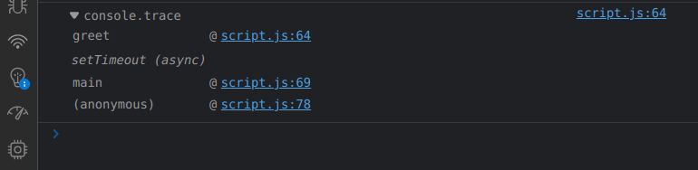

Learn more about stack tracing using `console.trace()` [below](#centerstack-tracing-using-consoletrace-methodcenter).

### `console.warn(<arg>)` and `console.error(<arg>)` method

- `console.warn()` method outputs a warning message to the Web browser's console.
- `console.error()` method output an error message to the Web browser's console.
An example of both is shown below. 


### `console.time(<arg>)` and `console.timeEnd(<arg>)`

The `console.time()` method starts a timer we can use to track how long an operation takes.

Each timer is given a unique name. 

When we call `console.timeEnd()` with the same name, the browser will output the time, in milliseconds, that elapsed since the timer was started.

Input:
```javascript
console.time("Your code took");
console.log("Hello World");
console.timeEnd("Your code took");
```

Output:
```
Your code took: 4.3919237898ms
```

### `console.table(<arg>)` method

This method displays the keys and values of the object passed to it in tabular form.

### `console.clear()` method

This clears the Browser's console.

---

## `Window` API 

The `Window` API is used to obtain information about and manipulate the browser-window.

In the case of browsers, the [Global Execution Context](#global-execution-context) has its global/`this` object as `window`, which represents the browser window in which the script is running, typically on the **client** side. 

Since it is a global object, its methods and properties can be directly accessed, without having to use the prefix `window`.

It only works in browsers and not in regular scripts running locally using node, because only browsers have `window` context.

In node, accessing window is meaningless because there's no browser window.

### Usage of `window.console` object

`window.console` returns a reference to the console object which provides access to the browser's debugging console.

In simple words, it checks if the console is available(truthy value) so that we can log next.

In the case of mobile browsers or general code editors, they don't support debugger/console).

Try running this in your browser's console:

```javascript
if( window.console ) {
    window.console.log( open_date );
};
```

### Useful properties of the `window` object

#### `window.innerWidth`

The read-only Window property `innerWidth` returns the interior width of the window in pixels. This includes the width of the vertical scroll bar, if present.

---

#### `window.innerHeight`

The read-only `innerHeight` property of the window [interface](#interfaces-in-typescript-mentioned-in-mdn) returns the interior height of the window in pixels, including the height of the horizontal scroll bar, if present.

---

#### `window.scrollX`

The read-only `scrollX` property of the Window **[interface](#interfaces-in-typescript-mentioned-in-mdn)** returns the number of pixels that the document is currently scrolled horizontally.

TODO: Difference between Window [interface](#interfaces-in-typescript-mentioned-in-mdn) and global Window object

---

#### `window.scrollY`

The read-only `scrollY` property of the Window [interface](#interfaces-in-typescript-mentioned-in-mdn) returns the number of pixels that the document is currently scrolled vertically.

---

### `window.document`

More details under [DOM (Document Object Model)](#dom-document-object-model)

---

### Other methods of `window` object

These methods only work on browsers since only browsers have the pre-existing global `window` object.

We can choose to use these methods without the `window` prefix because, as mentioned previously, browsers have `window` [context](#window-object-and-context).

Note that there should be no locally defined function with the same name, otherwise just using the method name would lead to the local function being called.

This is why it is safer to use the methods along with the prefix of `window` to ensure selection of the correct function definition.

---

#### `window.prompt()` or `prompt()`

TODO

---

#### `window.confirm()` or `confirm()`

TODO

---

#### `window.alert(<arg>)` or `alert(<arg>)`

The alert() method displays an alert box with a message and an OK button.

The alert box takes the focus away from the current window, and forces the user to read the message.

For example:


Note that this is not used nowadays. Instead, we use Bootstrap etc, to show beautified alerts.

---

## `History` API

The `History` API exposes useful methods and properties that let you navigate back and forth through the user's history, and manipulate the contents of the history stack.

We are given access to it through the [`Window`](#window-api) API. 

the `window.history` read-only property returns a reference to the [`History`](#history-interface) object (i.e., the `history` key of the `window` object has value as the reference to the `History` object), which provides an interface for manipulating the browser [session](#what-is-a-session) history.

Note that the history refers to the pages visited ONLY in the tab or frame that the current page is loaded in.

It is also referred to as the `History` [API](#apis-in-javascript) in sources like MDN, since `History` object is used to get the session history of the user back to the application made using JavaScript, for manipulation. 

### `window.history.length`

### `window.history.back()` or `window.history.forward()` or `window.history.go()`

Moving backward and forward through the user's history is done using the `back()`, `forward()`, and `go()` methods.

- To move backward through history: `window.history.back()`.
This acts exactly as if the user clicked on the `Back` button in their browser toolbar.

- To move forward: `window.history.forward()`.
This acts exactly as if the user clicked on the `Forward` button in their browser toolbar.

- To move to a specific point in history: `window.history.go(integerVal)` loads a specific page from session history. 
  
  The current page's position is 0 and an integer value relative to the current page has to be passed. For example, we can move forward one page by passing 1.

---

## `Location` API

The `Location` API is used to access various details about the current page such as host, hostname, URL, pathname, etcetera.

We are given access to it through the [`Window`](#window-api) API. 

The `window.location` read-only property returns a reference to the `Location` object ((i.e., the `location` key of the `window` object has value as the `Location` object)), with information about the current location of the document.

It represents the current **URL** of the document being displayed in that window.

Though `window.location` is a read-only `Location` object, we can also assign a string to it. 

This means that you can work with `location` as if it were a string in most cases: `location = http://www.example.com` is a synonym of `location.href = http://www.example.com`. But the latter is preferred.

### `window.location.href` vs. `window.location.assign` vs. `window.location.replace()`

All three commands are used to redirect the page to another page/website but differ in terms of their impact on the browser history, safety and return values.

#### `window.location.href` property 

It is a property of `window.location` that stores the URL of the current webpage.

On changing the value of `href` property, a user would be navigated to a new URL, i.e. sent to a new webpage. 
  
It adds an item to the history list, so that the user can return to the current page upon clicking the `Back` button. 

It is faster than using the `assign()` method as calling a function is slower than changing the value of the property.

#### `window.location.assign()` method

It is a property of `window.location` that stores a function expression. 

The `assign` function is also used to navigate to a new URL. But it is preferred over updating the `href` property as calling a function is considered safer and more readable.

However, it does not show the current location, it is only used to go to a new location.

The `assign()` method is also preferred over `href` as it allows the user to mock the function and check the URL input parameters while testing, instead of directly assigning a faulty URL to the `href` property.

Unlike the `replace` method, the `assign` method adds a new record to history so that the user can return to the current page upon clicking the `Back` button.

#### `window.location.replace()` method 

It is a property of `window.location` that stores a function expression. 
  
It is used to navigate to a new URL without adding a new record to the history. 

The user won't be able to navigate back to the current page upon clicking the `Back` button.

### `window.location.reload()`

The `reload()` method reloads the current document. It is the same as clicking the reload button in your browser.

### `window.location.toString()`

The `window.location.toString()` [OVERRIDEN](#function-overriding-in-javascript) definition of `Object.prototype.toString` of the Location interface returns a string containing the whole URL. It is a read-only version of `window.location.href`.

---

## `Clipboard` API

The `Clipboard` [API](#apis-in-javascript) adds to the `Navigator` interface, the read-only clipboard property, which returns the [`Clipboard`](#clipboard-interface) object used to read and write the clipboard's contents.

---

## Mutation Observer API

This API is implemented by the [`MutationObserver` interface](#mutationobserver-interface), and it provides the facility of invoking a callback function in reaction to the changes being made to the DOM tree.

---

# Interfaces (Not available in JavaScript)

## `History` Interface

The `History` interface allows manipulation of the browser session history (that is, the pages visited in the tab or frame that the current page is loaded in).

## `Navigator` Interface

The `Navigator` interface represents the state and the identity of the user agent. 

It allows scripts to query it and to register themselves to carry on some activities.

A `Navigator` object can be retrieved using the read-only `window.navigator` property.

## `Clipboard` Interface

The `Clipboard` interface implements the Clipboard [API](#apis-in-javascript), by providing—if the user grants permission—both read and write access to the contents of the system clipboard. 

The Clipboard [API](#apis-in-javascript) can be used to implement cut, copy, and paste features within a web application.

The system clipboard is exposed through the GLOBAL `Navigator.clipboard` property.

## `MutationObserver` Interface

The MutationObserver interface implements the [Mutation Observer API](#mutation-observer-api) by providing the ability to watch for changes being made to the DOM tree. 


# Prototypes

TODO

---

# Variable and Constant values

## `let` & `var` keywords for variables

- `let` is block-scoped, sa variable declared with `let` can only be access inside a block of code.
  
  `var` is function-scoped, so a variable declared inside a function with `var` can be used anywhere within a function.
  
- `let` does not allow to redeclare variables
  
  `var` allows to redeclare variables.
  ```javascript
  let blockScope = 5; // 5
  let blockScope = 3; // error

  var funcScope = 5; // 5
  var funcScope = 3; // 3
  ```

It would be better to use `let` when defining variables since both `let` and `const` have block-level scope, so resolving scopes would be easier and consistent.

Note that there are also differences in how `let` and `const` variables are [Hoisted](#hoisting). The concept of [Temporal Dead Zones](#temporal-dead-zone) is also important in differentiating these. 

`let` and `const` also [aren't automatically members of the `window` object](#different-storage-location-for-let-and-const-variables) in Browser JS Engines, which is the case in variables declared using `var`.

---

### Example for understanding the difference between `let` and `var`

1. The following code-snippet uses the `var` keyword.

    ```javascript
    var a = 0;
    if(true){
        var a = 1; 
        // `a = 1` would have yielded the same result.

        console.log(a);
    }
    console.log(a);
    ```
    We know that `var` variables are function-scoped, so the entire snippet belongs to the same scope.

    Also, `var` allows for re-declarations of variables, which is why no error is thrown in re-declaring `a` within the if-statement, which is in actuality the same scope.

    So, when we assign value for `a` as `1` within the if-statement, `a` is changed for the entire function-scope, which is why the output has two 1s.

    Output:
    ```
    1
    1
    ```

2. The following code-snippet uses the `let` keyword.

    ```javascript
    let b = 0;
    if(true){
        let b = 1;
        console.log(b);
    }
    console.log(b);
    ```

    We know that `let` variables are block-scoped, so the scope is different INSIDE & OUTSIDE the if-condition.

    So, the declaration of `b` INSIDE the if-condition is local to that block and it is destroyed upon exiting the block, which is why the first value is 1 and the second value is 0.

    Note that we could also have considered the outside block as the main block, with the whole code being considered as ONE block.

    Output:
    ```
    1
    0
    ```

Note that C & C++ are block-scoped. The following C++ code-snippets replicate this behavior:

1. Replicating behavior of `var`
   ```cpp
    int main() {
      int a = 0;
      if(true){
          a = 1; 
          // `a` from the OUTER scope is modified.
          printf("%d\n", a);
      }
      printf("%d\n", a);
    }
   ```
2. Replicating behavior of `let`
   ```cpp
    int main() {
      int a = 0;
      if(true){
          int a = 1; 
          // new `a` created, which has scope within 'if'.
          // It is destroyed as soon as scope of 'if' gets over
          printf("%d\n", a);
      }
      printf("%d\n", a);
    }
   ```

--- 

## `const` keyword for CONSTANT variables

Values defined using `const` have block-level scope.

If you are sure that the value of a variable won't change throughout the program, it's recommended to use `const` so as to prevent any errors later on due to changing on variables not meant to be changed. 

Note that it isn't possible to declare constants without initializing them.
This is an example of erroneous code:
```javascript
const x;  // Error! Missing initializer in const declaration.
x = 5;
console.log(x)
```

This is correct:
```javascript
const example_2 = "yo";
console.log(example_2);
```

---

## Temporal Dead Zone

The `let` and `const` variables are Hoisted but they aren't even initialized with the `undefined` spatial placeholder like `var` is, so trying to access them before they are initialized, in the code execution phase throws an error of this sort:

```
Uncaught ReferenceError: Cannot access 'a' before initialization
```

The phase between the starting of the execution of block in which the `let` or `const` variable is declared till that variable is being initialized is called **Temporal Dead Zone** for the variable.

So, it is BEST PRACTICE to keep variable declarations and initializations at the TOP of blocks to avoid unwanted Errors.

---

## Different Storage Location for `let` and `const` variables

The variables declared using `let` and `const` keywords aren't automatically members of the GLOBAL `window` object in Browser JS Engines, like variables declared using `var` are.

Considering the following code-snippet:

```javascript
var a = 10;

let b = 10;

if(true) {
    let c = 20;
}
```

If we take a look at the Browser Console while the control is inside the if-block, we see something like this:

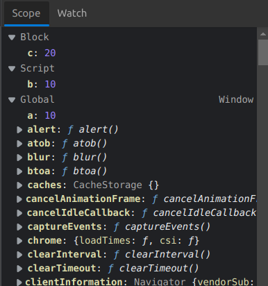

- Note how `a` is stored under the GLOBAL `window` object, represented as `Global`.
- The variable declared using `let` OUTSIDE if-block, which is `b` is under something called `Script` scope.
- The variable declared using `let` INSIDE if-block, which is `c` is under something called `Block` scope, representing the fact that its scope lies inside an if-BLOCK.

This is a practical explanation of why `a`, declared using `var` keyword, can be accessed using `window.a`, and why `b` and `c`, which were declared using `let` keyword, CANNOT.

---

## Are **function parameters** `var` or `let` variables?

`let` and `const` are relatively new features in the language, they were added in EcmaScript 6. 

Prior to this, all variables were either global or local to the function. 

In the function body we declare local variables with `var`, but **function parameters** are automatically local so there's no need for a keyword to distinguish them from global variables.

In a sense, **function parameters** can be thought of as variables local to the function declared using the `var` 
keyword.

---

## Accessing global variables of the same name as local variables

> **_NOTE:_**  The creation of GLOBAL variables in Node JS is slightly different from Browser JS Engines. 

- When we create any variable in the global execution context of browsers, it automatically becomes a member of the `window` object. These GLOBAL variables can be accessed even by prefixing `window` or without prefixing `window`, as discussed in the [Window API](#window-api).

  ```javascript
  var globVar = 1; // Browser JS Engine

  console.log(globVar);
  console.log(window.globVar); // Both work
  ```

- In order to create GLOBAL variables in Node, we need to use the `global` prefix. Although after creation, they can even be used without the `global` prefix. However, it is BAD PRACTICE to use `global` variables so we don't use these often.

  ```javascript
  global.globVar = 1; // Node JS

  console.log(globVar);
  console.log(global.globVar); // Both work
  ```

### Global Execution Context as a Function Scope

Variables created using `var` keyword are function-scoped.

We know that scripts are placed in **ANONYMOUS** functions before calling them to make them run. So, the global execution context in Browser JS Engines or Node is actually a function scope.

So, the variables declared using `var` in the global execution context are available everywhere for the entire run-time of the program, since the global **ANONYMOUS** function scope is everywhere.

Take a look at this code-snippet for Browser JS Engines:

```javascript
var x = 1;

console.log(x);

function funcA() {
    var x = 10;
    console.log(x);
    console.log(window.x);
}

funcA();
```

Output:
```
10
1
```

As mentioned above, GLOBAL scope variables in Browsers are automatically properties of the GLOBAL object `window` of the global execution context of a particular script, which is why we are able to access the global variable `x` using `window.x`, instead of the local variable `x`.

A somewhat similar logic would also apply for **Node**.

---

# Values vs. References in Javascript

Javascript has 5 data types that are passed by **value**: `Boolean`, `null`, undefined, String, and Number. We’ll call these primitive types.

Javascript has 3 data types that are passed by **reference**: Array, Function, and Object. These are all technically Objects, so we’ll refer to them collectively as Objects.

TODO : Complete

# Functions in Javascript 

In javascript, functions are also objects.

There is a global `Function` class which has static as well as prototype methods.

We know that an object persists in heap memory and is not garbage-collected as long as there is a reference to it. 

> **NOTE:** This is the concept seen in [Closures](#closures), where a function defined inside another function is still able to access the variables of the outer function, even when the scope of the outer function is over.
>
> This is due to the fact that the closure of the inner function stores a **reference** to its lexical environment (which is the outer function).

## First-class Functions

A programming language is said to have **First-class functions** when functions in that language are treated like any other variable.

For example, Javascript is said to have First-class functions since:
- functions can be passed as an argument to other functions.
- can be return by another function
- can be assigned as a value to a variable.

## Function DECLARATION vs Function EXPRESSION

The main difference between a Function DECLARATION and a Function EXPRESSION is of [**Hoisting**](#hoisting).

### a. Function DECLARATION

```javascript
function functionName(paramA, paramB) {
    // Set of statements
}
```

A function declaration also known as a **function statement** declares a function with a `function` keyword. 

The function declaration must have a function name, it cannot be ANONYMOUS.

Due to [hoisting](#hoisting), it can be called before its definition is reached in the code execution phase, because the definition is already stored in the execution context in the memory allocation phase.

For example:
```javascript
yo(); // Function INVOKATION

function yo(){
    console.log("This is a functional declaration");
};
```

### b. Function EXPRESSION

A function EXPRESSION, in simple terms, is just a function DECLARATION without the function identifier name, but it CANNOT be used like a function DECLARATION

For instance, this will give a syntax error:

```javascript
function () {
  console.log("Hello");
}
```

Output:

```
SyntaxError: Function statements require a function name
```

Instead, Function Expressions are used by be assigning them to variables/keeping them as property values in Javascript.

> **NOTE:** If we specify a name for the Function getting stored in a variable, it is known as **Named Function Expression**.

However, Function EXPRESSIONS don't have the advantage of [Hoisting](#hoisting) that Function DECLARATIONS do.

This is because only variable declarations are hoisted, not variable initializations.

Since the value of variables contain function expressions, the function itself is not accessible before the initialization of the variable storing it takes place.

For calling the function expression, we just use the name of the variable it is stored in followed by arguments.

For example:
```javascript
var variableName = function (paramA, paramB) {
    // Set of statements
};

variableName(valueA, valueB);
```
OR
```javascript
const objectName = {
  funcEx:  function (paramA, paramB) {
            // Set of statements
  },
  key1: value1
};

objectName.funcEx(valueA, valueB);
```
They can also be used in [IIFE](#immediately-invoked-function-expression-iife)s (which function declarations can be too but it is more appt. 
to use function expressions).

#### Trying to call the function definition of a Named Function Expression

Consider the following code-snippet:

```javascript
var funcExpression = function bar() {
  console.log("hello");
}

bar();
```

This will throw an error saying `bar` is not defined because the definition of `bar` is not in the scope from where we are trying to call it.

Because the name `bar` is used within a function expression, it doesn't get declared in the outer scope. 

With named function expressions, the name of the function expression is **enclosed within its own scope**.

---

## `arguments` object

`arguments` is an [`Array`-like object](#what-is-an-array-like-object) accessible inside functions that contains the values of the arguments passed to that function.

For example:
```javascript
function func1(a, b, c) {
  console.log(arguments[0]);
  // expected output: 1

  console.log(arguments[1]);
  // expected output: 2

  console.log(arguments[2]);
  // expected output: 3
}

func1(1, 2, 3);
```

## No Parameters vs. Default Parameters

In JavaScript, function parameters default to [`undefined` data type](#undefined), if no parameters are provided. 

Suppose we have the following code:
```javascript
function print_message(message) {
console.log("Message is : " message);
};
print_message();
```
The output would be:
```
Message is : undefined
```

However, it's often useful to set a different default value. This is where default parameters can help.

```javascript
function functionName(param = defVal) {
// function body
};
```
Here `defVal` is the default value for the argument `param`.

## Function Overriding in Javascript

JavaScript supports overriding, not overloading. 

When you define multiple functions that have the same name, the last one defined will override all the previously defined ones and every time when you invoke a function, the last defined one will get executed.

- Here is an example of overriding a user-defined function:
 
  ```javascript
  <script type="text/javascript">  
      function multiplyNum(x, y, z) {  
          return x * y * z;  
      }  
    
      function multiplyNum(x, y) {  
          return x * y;  
      }  
      var result = multiplyNum(1, 2, 3);  
      document.write(result);  
  ```

  Output
  ```
  2
  ```

  Looking at the above example, the value of multiplication will be equal to 2 instead of 6.
  
  In this case, the only function available is `multiplyNum(x, y)`. So if we think we are making a call to `multiplyNum(x, y, z)`, it's actually calling `multiplyNum(x, y)`. 

  The remaining parameter(s) will be ignored.

- Here is an example of overriding the in-built `alert()` function:

  ```html
  <script type="text/javascript">  
      var alert = function(message) {  
          document.write(message);  
      }  
      // The following calls will invoke the overridden alert() function  
      alert("Learn ");  
      alert("JavaScript");  
  </script> 
  ```

  Output:

  ```
  Learn JavaScript
  ```

  By default, `alert()` function displays the message in the alert box. But here we have overridden it. Now it is displaying the message in the [`document`](#document-object).

## Higher-order Functions

A higher-order function is a function that accepts functions as parameters and/or returns a function.

Take a look at the following example:

```javascript
const radius = [3, 1, 2, 4];

// outputArrayGen is a higher-order function
function outputArrayGen(radiusArray, callbackFn) {
    const output = [];
    for(let index = 0; index < radiusArray.length; index++) {
        output[index] = (callbackFn(radiusArray[index]));
    }

    return output;
}

area = function(radius) {
    return (Math.PI * radius * radius);
}

circumfrence = function(radius) {
    return (2 * Math.PI * radius);
}

diameter = function(radius) {
    return (2 * radius);
}


console.log(outputArrayGen(radius, area));
console.log(outputArrayGen(radius, circumfrence));
console.log(outputArrayGen(radius, diameter));
```

## `call` method of 'global Function class'

TODO

## `this` object of functions

'this' object of a function is by-default 'undefined'.

We can manipulate its properties etc and use it to create more objects with the help of constructor functions.

## Immediately Invoked Function Expression (`IIFE`)


`IIFE`, Immediately Invoked Function Expression, is a JavaScript function that runs as soon as it is defined.

It is a design pattern which is also known as a **Self-Executing Anonymous Function** and contains two major parts:

- The first is the function expression (no-name function).

    Note that we can provide a named function (FUNCTION DEFINITION) over here as well with [lexical scope](#meaning-of-lexical-scope) enclosed within the Grouping Operator `()`.

    Even though we can use both function definitions and expressions in IIFEs, we should use definitions anyway to make our code more readable. 

    ##### Meaning of lexical scope

    The ability where the inner function can access the parent function scope is known as **lexical scope**.

    This prevents accessing variables within the IIFE idiom as well as polluting the global scope.

- The second part creates the immediately invoked function expression () through which the JavaScript engine will directly interpret the function.

For example:
```javascript
(function IIFE() {
    console.log("This is an IIFE");
    //variables defined here can't be accessed outside but they can be accessed by functions defined inside this function.
    })() // the function is immediately invoked  
```

Check out [20B-IIFE.js](./workshopper-javascripting-scripts/20B-IIFE.js) for an example implementation of IIFEs.

### Use-case of an `IIFE`

- When we don't want to re-use the code of the function and don't want to add to the already extensive global namespace, so the functions of an `IIFE` can't be called externally. 

    This is why we can use function expressions (no-name functions) since we don't have to call it later on. 

    However, we can still name it (use function declaration) in order to organize our code.

* It is a common pattern for creating local scopes.  

# General information about Javascript

## Template literals and string interpolation in Javascript

TODO

## Ending statements with semi-colons

Although ending statements (NOT BLOCKS of code like if-else) with semi-colons is optional in JavaScript, it is best practice to do so in order to avoid any edge-case behaviour where statements place on two different lines are interpreted together.

## Hoisting 

**Hoisting** in JavaScript refers to the process whereby the interpreter **APPEARS** to move the declaration of functions, variables of type `var`, or classes to the top of their scope, prior to execution of the code. 

Note, JavaScript only hoists declarations, not initializations! 

This means that initialization doesn't happen until the associated line of code is executed, even if the variable was originally initialized then declared, or declared and initialized in the same line.

Until that point in the execution is reached the variable has its default initialization (`undefined` for a variable declared using `var`, otherwise uninitialized).

To summarize...

- function declarations are already in memory, ready to be called, before the execution of the code starts.
- variables of type `var` are allocated memory and assigned the spatial placeholder value of `undefined`.
- variables of type `let` and `const` are **uninitialized** (NOT even the spatial placeholder value of `undefined`). 
  
  Read about [Temporal Dead Zones](#temporal-dead-zone) for in-depth understanding of these cases.

- TODO: <!-- class hoisting https://developer.mozilla.org/en-US/docs/Glossary/Hoisting#class_hoisting -->

However, this seems like quite an abstract concept.

A practical explanation of how **Hoisting** works can be obtained by reading about [Phases of Execution Contexts](#phases-of-execution-contexts)

## Closures

A Closure is a function bundled together (enclosed) with references to its Lexical Environment.

In other words, a closure gives us access to an outer function's scope from an inner function.

A closure in JavaScript is like keeping a reference (NOT a copy) to the scope at the point of function declaration, which in turn keeps a reference to its outer scope, and so on, all the way to the global object at the top of the scope chain.

> **NOTE:** Variables themselves are visible from within a closure, not copies. 
> 
> So, any mutation operations on the variables within the function change their values for future calls as well.

A closure is created when a function is declared; this closure is used to configure the execution context when the function is invoked.

Even in the case of functions declared the global scope, we know that a Javascript file itself is kept inside an **anonymous function** and called, in most Javascript runtime environments.

So any function declared and called in the global scope (scope of the **anonymous function**) is closed by that **anonymous function**.

### Uses of Closures

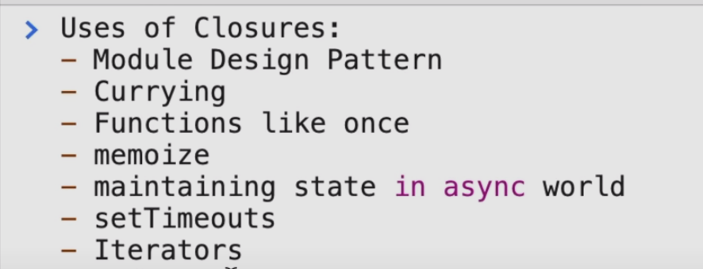

### Examples for understanding Closures

#### **First Example**

- The following is an example of a **Closure** :
  
  ```javascript
  function main() {
      var x = 1;
      
      function nested() { // closed by 'main'
          console.log(x);
      }
      
      return nested;
  }

  var fn = main();
  // The closure of 'nested' stored in this variable

  fn();
  ```

  The function `nested` can access the the scope of the function `main`.

- Let's add some complexity to the above code-snippet:

  ```javascript
  function main() {
      var x = 1;
      
      function nested() {
          console.log(x);
      }

      x = 100;

      return nested;
  }

  var fn = main();

  fn();
  ```

  Here, since the function `nested` has access to the lexical environment of `main`, and the value of the variable `x` is changed to `100` before the `return` statement is reached, the value of `x` is changed to 100 for all future calls to `nested`. 

  So, the output of this would be `100`.

#### **Second Example** (Helpful for understanding how stack tracing works)

We have to understand that the fact that a particular function, for example, `nested` is constructed inside of another function `main` and closes over some of its variables, is insignificant to what functions are displayed in the [execution stack](#working-of-execution-stack-in-javascript) when `nested` is called.

This is because the execution stack doesn't care where the values are defined. 

The only thing that the execution stack cares about is, when function `nested` is executed, which function's execution caused it. 

- Take a look at the first code-snippet:
  ```javascript
  1 function main() {
  2   function nested() {
  3       console.trace();
  4   }
  5   nested();
  6 }
  7   
  8 const fn = main(); 
  ```

  At line 8, `top-level` calls `main`, which calls `nested` (At line 5 of the definition of `main`).

  Because of this, the stack trace of this code looks like this:
  
  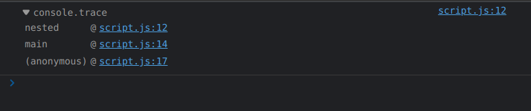

- The second-code snippet is slightly different:
  
  ```javascript
  1 function main() {
  2   function nested() {
  3     console.trace();
  4   }
  5   return nested;
  6 }
  7
  8 const fn = main();  
  9 fn()
  ```

  At line 8, top-level calls `main`. 
  
  At line 9 top-level directly calls `fn`, a.k.a `nested`.

  Because of this, the stack trace of this code looks like this:

  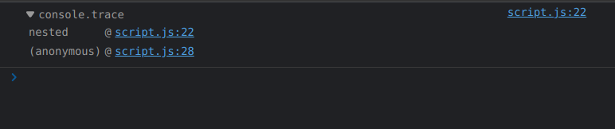

---


## Javascript Engines

A JavaScript engine is a software component that executes JavaScript code. 

The first JavaScript engines were mere interpreters, but all relevant modern engines use just-in-time compilation for improved performance.

JavaScript engines are typically developed by web browser vendors, and every major browser has one. 

In a browser, the JavaScript engine runs in concert with the rendering engine via the Document Object Model.

The use of JavaScript engines is not limited to browsers. For example, the V8 engine is a core component of the Node.js and Deno runtime systems.

---

## Execution Contexts in Javascript

Simply put, an **Execution Context** is an abstract concept of an environment where the Javascript code is evaluated and executed. 

Whenever any code is run in JavaScript, it’s run inside an **Execution Context**.

---

### Lexical Environment & Scope Chain

Every execution context has a **reference** to its outer environment, and that outer environment is called Lexical Environment.

> ***NOTE:*** The Lexical Environment of a function is the combination of the function's Execution Context and the **reference** to the Lexical Environment of its PARENT.
> 
> Also, by PARENT, we mean the Lexical PARENT i.e., the location where the function declaration sits, NOT where the function was CALLED from.

JavaScript cares about the Lexical Environment when you ask for a variable while running a line of code inside any particular execution context if it can’t find that variable in its block, it will go to the outer **reference** and look for variables there.

So we can say that whenever a execution context is created, along with it a lexical environment is created. 

Suppose a function is called. Now, any other functions called within THAT function will have access to the lexical environment of THAT function through a **reference**.

> **NOTE:** Observe that because a **reference** to the lexical environment is stored, any changes to the variables of the lexical environment are updated for future calls of the function.

If a chain of **references** to Lexical Environments is formed, it is known as **Scope Chain**.

Consider the following code-snippet:

```javascript
function two(){
  console.log(a);
}

function one(){
  var a = 2;
  console.log(a);
  two();
}

var a = 1;
console.log(a);
one();
```

Due to hoisting, the functions `one` and `two` will have their definitions stored during the creation phase, and the declaration of the variable `a` will also be present.

During the code execution phase:

1. `a` will get the value `1`.
2. The `log` method will try to display `a`. The global execution context has the variable `a` with value `1`, so _`1` will be logged_.
3. The function `one` will be called.
   1. Within the execution context of `one`, a local variable with name `a` will get value `2`.
   2. The `log` method will try to display `a`. The execution context of `one` has the variable `a` with value `2`, so _`2` will be logged_.
   3. The function `two` will be called.
      1. The `log` method will try to display `a`. 
       
        Since the execution context of `two` doesn't have the variable `a`, it will check the **reference** to the Lexical Environment of its parent, which is the global execution context.

        Since the global execution context has the variable `a` with value `1`, _`1` will be logged_.

So, the output of the code-snippet is:

```
1
2
1
```

Note that the following C++ code also behaves in a similar manner. It has some slight changes since any phenomenon similar to Hoisting isn't available in C++.

```cpp
int a = 1;

// two() will print 1 since that is in its outer scope and no local 'a' variable.
void two(){
  cout << a << endl;
}

// one() will print 2 since that is in it scope.
void one(){
  int a = 2;
  cout << a << endl;
  two();
}

// main() will print 1 since that is in its outer scope and no local 'a' variable.
int main() {
    cout << a << endl;
    one();    
    return 0;
}
```

Output:
```
1
2
1
```

---

### Phases of Execution Contexts

Each **Execution Context** has two phases: creation phase and execution phase.

Read a summary of both below or for more in-depth understanding, check out an example [here](https://www.javascripttutorial.net/javascript-execution-context/#:~:text=When%20the%20JavaScript%20engine%20executes,phase%20and%20the%20execution%20phase.).

---

#### Creation Phase

During the creation phase, the JavaScript engine performs the following tasks:

1. Setup a memory heap for storing variables and function references.

2. Store the function declarations in the memory heap.

    So, the function declarations are already in the memory even, ready to be called, even before the code is executed.

3. Also, store variables within the global execution context with the initial values as `undefined`.

Steps 2 and 3 are practical examples of [Hoisting](#hoisting).

---

#### Execution Phase

After the Creation Phase, the execution context moves to the **Execution Phase**. 

During the execution phase, the JS engine executes the code line-by-line, assigns the values to variables, and executes the function calls.

For each function call, the JS engine creates a new function execution context.

---

### Types of Execution Contexts

There are two types of **Execution Contexts** in Javascript:
- Global Execution Context
- Functional Execution Context

But, before looking at these in detail, we must understand how the Execution Stack works in Javascript:

---

#### **Working of Execution Stack in Javascript**

Execution stack, also known as “calling stack” in other programming languages, is a stack which is used to store all the [execution contexts](#execution-contexts-in-javascript) created during the code execution.

When the [JavaScript engine](#javascript-engines) first encounters your script, it creates a [global execution context](#global-execution-context) and pushes it to the current **execution stack**. 

Whenever the engine finds a function invocation, it creates a new execution context for that function ([function execution context](#functional-execution-context)).

HOWEVER, note that all the execution contexts of functions also have access to the [Lexical Environment](#lexical-environment) of the execution context inside which they are DEFINED (not inside which they are CALLED).

The engine executes the function whose execution context is at the top of the stack, line-by-line. 

When this function completes, its execution context is popped off from the stack, and the control reaches to the context below it in the current stack.

##### <center>**Stack Tracing using `console.trace()` method**</center>

In computing, a stack trace is a report of the active stack frames at a certain point in time during the execution of a program.

In the case of Browser JS engines, we use the [`console.trace()`](#consoletrace-method) method for this purpose.

There are some things we need to understand when tracing:

1. The only thing that the execution stack cares about is, when a function is executed, which function's execution CAUSED it. 
   
   The **location of the definition of the function** does NOT matter.

    The [second example](#second-example-helpful-for-understanding-how-stack-tracing-works) given under Closures demonstrates this concept.

2. As mentioned later, under 
  
    In the case of Asynchronous calls, we know that all synchronous calls are executed before them and all execution contexts are popped from the execution stack, before the event queue pushes the context of the asynchronous call into the execution stack.

    Still, the dev-tools of your browser do keep track of the initial call stack (functions inside which the asynchronous call was made).
    
    They then REBUILD it for your convenience when you call `console.trace()` as shown in the output of the example BELOW.
  
    But the initial synchronous function calls are not on the stack anymore.

    Take a look at the following example:

    ```javascript
    function func() {    
            console.trace();
        }

    function main() {
      
        func();
        
        setTimeout(func, 0);
        
        console.log("End of main");
    }

    main();

    console.log("One last command");
    ```

    Here, BOTH a synchronous as well as an asynchronous call to a function `func`  is made inside an outer function `main` (this can be done BECAUSE `func` is actually accessible in the scope of `main`).

    In this case, the whole body of `main` would be executed first, along with the popping of the execution contexts of ANY synchronous calls (such as the synchronous call to `func`) made in `main`. 

    Also, commands in the Global Execution Context would be executed.
    
    After that, the asynchronous call to `func` would be executed.

    Take a look at the stack trace of this code-snippet obtained using `console.trace()`:
    
    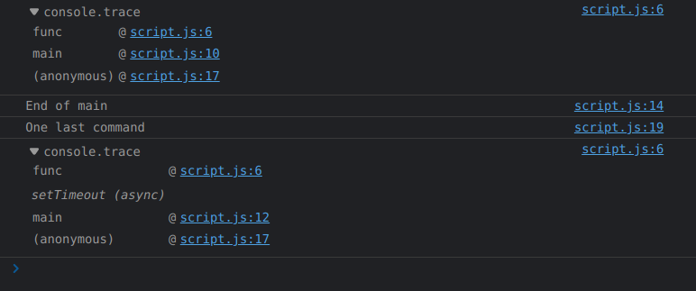

    - Observe how the `console.trace()` inside the asynchronous `func` call is only reached after `One last command`, in the global execution context, is logged.
    - Notice the difference between the stack trace of the synchronous and asynchronous call.

      Both calls occur from the same place, but in the case of the asynchronous one, the ***(async)*** suffix explicitly marks where the "real" stack ends. 

      The functions after the ***(async)*** suffix aren't actually in the Execution Stack, but the stack is still re-built by the browser dev-tools.

      It's shown because the browser thinks that if you need the trace, it's more because you want to know where the call came from in your code, rather than what was really on the internal call stack. 
      
      After all the goal is to be useful to the developers.

---

#### Global Execution Context
 
This is the default or base execution context. The code that is not inside any function is in the **global execution context**. 

It performs two things: 
- it creates a global object 
  -  `window` in case of Browser JS Engine.
  -   `global` in case of Node JS.
- sets the value of `this`
  - Equal to `window` in case of Browser JS Engine.
  - Equal to `module.exports` in case of Node JS. 
  
    `module.exports` can be used to export functions, objects, and their references from one JS file and can use them in other JS files by importing them by `require()` method.

    The object `global` can be accessed using `globalThis` keyword or `global` itself.


There can only be one **global execution context** in a program. 

> ***NOTE:*** The global execution context has a reference to the [Lexical Environment](#lexical-environment) outside it, pointing to **NULL**.

In the case of execution of asynchronous functions, the callback queue waits for all contexts (except for the context in which the asynchronous call was made) to be popped from the [Execution Stack](#working-of-execution-stack-in-javascript), before executing the asynchronous function calls present in the callback queue.

Take a look at this code snippet:

```javascript
var n = 10;

function callBackfunc() {
    console.log(n);
}


setTimeout(callBackfunc, 0);
```

The output is:

```
10
```

This is possible since the asynchronous call was made in the **global execution context** of the file, so the callback queue doesn't wait for the **global execution context** to be popped from the Execution Stack.

If the **global execution context** had ACTUALLY been popped from the Execution Stack, we would have got a `ReferenceError` saying that `n` is not defined.

---

#### Function Execution Context

Every time a function is invoked, a brand new execution context is created for that function. 

- The **function execution context** is similar to the global execution context. 

  But instead of creating the global object, the JavaScript engine creates the `arguments` object as the **function execution context**'s global object.

  So, instead of having to access the values of the parameters/arguments of the function call with the prefix `arguments` like `arguments.parameter1`, we can directly access `parameter1` because `arguments` is the global object.

- But, just like the global execution context, the `this` object of the **function execution context** is set to the global object of the global execution context.

There can be any number of **function execution contexts**.

---

##### **In Browsers, (Global Execution Context) is a (Function Execution Context)**

In the case of Browser [JS engines](#javascript-engines), the **global execution context** is also a **function execution context**.

This is confirmed by executing the `console.trace()` method in the global scope of a Javascript file running in a Browser. 

The following output is shown in the Browser console:

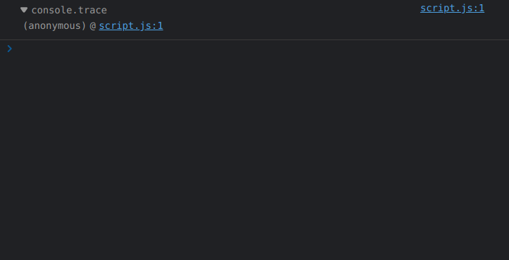

See how there is an **anonymous** function listed. This is the **main execution thread** of the page. 

So, we can conclude that Javascript files are put inside **anonymous** functions in the case of browser JS engines and those functions are called instead.

---

# Asynchronous Programming in Javasript

## Synchronous vs. Asynchronous Programming

- In **synchronous** programming model, things happen one at a time. 

  So, when you call a function that performs a long action, it returns the result only when the action has finished.

  This stops your program for the time the action takes.

- An **asynchronous** model allows multiple things to happen at the same time. 

## Callback functions

A callback function is a function passed into another function as an argument. The callback function can be invoked in two ways:
  - either synchronously, where it is executed instantaneously upon reaching its call. 
  - OR the more MAJOR  use of callback functions which is asynchronously, where it waits for a specific event to occur or a task to complete, before getting called and executed.

    Hence the name—the function argument is *called (back)* at a later point in time.

### Hack for passing arguments to Callback Functions

We know that we need to pass only function definitions when passing callbacks to [**higher-order functions**](#higher-order-functions), which is why we are unable pass arguments to callback functions.

In order to pass arguments into callback functions, we can use [**Closures**](#closures) and return a function definition.

The function definition returned will have access to the variables in its lexical environment (i.e., the outer function, which has its parameters as its ).

```javascript
function callBackReturn(num1, num2) {
    return (function callBack() {
        console.log(num1 + num2);
    });
}

setTimeout(callBackReturn(5, 10), 1000);
setTimeout(callBackReturn(10, 20), 2000);
```

### Callback Hell (Pyramid of Doom)

Callback Hell is essentially nested callbacks stacked below one another forming a pyramid structure. Every callback depends/waits for the previous callback, thereby making a pyramid structure that affects the readability and maintainability of the code.

Take a look at this example code-snippet:

```javascript
firstRequest(function(response) {  
    secondRequest(response, function(nextResponse) {    
        thirdRequest(nextResponse, function(finalResponse) {     
            console.log('Final response: ' + finalResponse);    
        }, failureCallback);  
    }, failureCallback);
}, failureCallback);
```

This type of code-block is referred to as a "**Pyramid of Doom**", which arises when a program uses many levels of nested indentation to control access to a function.

### Inversion of Control

In the Inversion of Control principle, the framework controls the app's flow and up to the developer is to provide the custom logic.

> Suppose a developer defines a function, and passes it to an API, to call-back when a certain task is done. 
>
> So here, the developer passes the control of calling the defined function to the API, instead of manually calling the function.
>
> This is an example of [Dependency Injection](#dependency-injection).

#### Dependency Injection

In software engineering, dependency injection is a **design pattern** (A general repeatable solution to a commonly occurring problem in software design) in which an object or function receives other objects or functions that it depends on.

Let's try to understand this with the help of an example:

Say you have some sort of "repository" class, and that repository is responsible for handing data to you from a data source.

The repository could establish a connection to the data source by itself. But what if it allowed you to pass in a connection to the data source through the repository's constructor?

By allowing the caller to provide the connection, you have decoupled the *data source connection* **dependency** from the repository class, allowing any data source to work with the repository, not just the one that the repository specifies.

In a sense, we **injected** the required dependency. Here, the control being inverted is setting an object's dependencies (control inverted from the object's constructor to programmer).

Dependency injection is only a subset of inversion of control. There are other things totally unrelated to dependency injection that practice inversion of control.

## Event Loop

The event loop concept is very simple. 

There’s an endless loop, where the JavaScript engine waits for a "message", dequeues the "message" and calls the associated [Callback Function](#callback-functions), and once the Callback Function finishes processing, it begins to wait for more "messages".

The increment that the event loop moves in is called a 'tick', and every time it 'ticks' it checks if the [Execution Stack](#working-of-execution-stack-in-javascript) is empty, and if it is, it dequeues the top-most "message" in the event queue (combination of [Microtask Queue](#microtask-queue) & [Callback Queue](#callback-queue)) to the call stack and executes it. 

Once it is finished processing this function, it starts ticking again.

The general algorithm of the engine:
  1. While there are "messages" in the [callback queue](#callback-queue):
      - dequeue them and call the associated callback function, one-by-one, starting with the oldest task.
  2. Sleep until another "message" appears, then go to 1.

Explaining this algorithm....

At some point during the event loop, the runtime starts handling the messages in the [callback queue](#callback-queue), starting witspreadh the oldest one. 

To do so, the message is removed from the queue and its corresponding callback function is called with the message as an input parameter. 

As always, calling a function creates a new stack frame for that function's use.

The processing of the function continues until the stack is once again empty. 

Then, the event loop will process the next message in the queue (if there is one).

### Run to completion

As hinted by this algorithm, each message is processed completely before any other message is processed.

A downside of this model is that if a message takes too long to complete, the web application is unable to process user interactions like `click` or `scroll`. 

The browser mitigates this with the **"a script is taking too long to run"** dialog. 

A good practice to follow is to make message processing short and if possible cut down **one** message **into several** messages.

## Callback Queue

The queue of "messages" we are talking about above is referred to as Callback Queue.

Note there is a need of Callback QUEUE instead of the Event Loop directly handling messages because there can be multiple messages waiting to be processed, in which case they need to be stored somewhere.

## Microtask Queue

Alongside the Callback Queue, there is another queue monitored by the Event Loop known as the **Microtask Queue**.

[Promises](#promises) and the [Mutation Observer API](#mutation-observer-api) both use the **Microtask Queue** to run their callbacks.

### Starvation of Callback Queue because of Microtask Queue

If suppose the Microtasks within the **Microtask Queue** recursively create more Microtasks, the "messages" in the Callback Queue won't every get a chance to get de-queued.

This phenomenon known as **Starvation of Functions in Callback Queue**.

---


---

## Registering of Functions in Web API environment

### `setTimeout` Web API Event

Let us take an example code-snippet:

```javascript
console.log("Hello");

setTimeout(function callbackFn() {
  console.log("setTimeout callback executed");
}, 0);

console.log("World");
```

Suppose we run this code using a Browser's JS Engine.

- We will get access to the Browser's console using the [`console` Web API](#console-api).
- We get access to a timer through the `setTimeout()` function which is also a Web API. 

1. The first call is a synchronous call, so it is directly pushed into the [Execution Stack](#working-of-execution-stack-in-javascript) and executed directly, without anything getting registered in the Web API environment.

2. Since the second command is an attempt to asynchronously call the function `callbackFn` using a Web API meant to keep track of time. 

  So, in this case, `callbackFn` will be registed in the Web API environment, so that it can be pushed into the Event Queue of the Event Loop upon COMPLETION of the Event linked to the Web API (which, in this case, is the passing of **0ms**).

  Once, the Event is completed and the "message" along with its associated callback is pushed into the Event Queue, `callbackFn` is de-registered from the Web API environment.

3. The last call is also a synchronous call, so it is directly pushed into the [Execution Stack](#working-of-execution-stack-in-javascript) and executed directly, without anything getting registered in the Web API environment.

4. Even if the `setTimeout` event gets completed before the last synchronous call, the [Event Loop](#event-loop) waits for the Execution Stack to get empty, and then dequeues the "message" from the Event Queue, and pushes `callbackFn` into the Execution Stack.

So, the output of the code-snippet is:
```
Hello
World
setTimeout callback executed
```

From this, we understand that synchronous Web API calls don't register anything in the Web API environment, but asynchronous Web API calls do.

---

### `DOM` Web API Event

Taking another example code-snippet:

```javascript
console.log("Hello");

document.addEventListener("click", function callbackFn() {
    console.log("Callback executed");
})

console.log("World");
```

1. The first and last call are similar to the above case.

2. The call in-between is an attempt to asynchronously call to `callbackFn` through the `DOM` Web API.

  The `addEventListener` method of the `DOM` API registers the callback function (or event-handler in this case) `callbackFn` in the Web API environment, so that it can be pushed into the Event Queue of the Event Loop upon OCCURRENCE of the Event linked to the Web API (which, in this case, is a `click` event occurring in the HTML Document).

  > NOTICE the use of the word OCCURRENCE, instead of COMPLETION, since the event-handler function will be pushed into the Event Queue of the Event Loop every time the Event occurs, until we EXPLICITLY remove the Event Listener.

  The `callbackFn` will be de-registered from the Web API environment, only when we use the `removeEventListener` method of the `DOM` API, to remove the event listener waiting for the `click` event to happen.

---

## Promises

A `Promise` is an object representing the eventual completion or failure of an asynchronous operation.

The structure of a `Promise` object is like this:

1. `pending` state (initial state, neither fulfilled nor rejected.)
   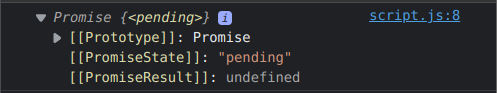
2. `fulfilled` state (meaning that the operation was completed successfully.)
   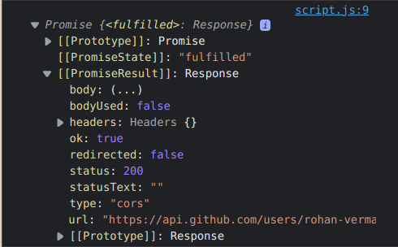
3. `rejected` state (meaning that the operation failed.)
   

Constructor for creating a new `Promise` object:
```javascript
new Promise(function executorFunction(resolve, reject) {
  // Executor code
})
```

Javascript has pre-defined
- The executor is called automatically and immediately (by new Promise).

- The executor function receives two callback functions as arguments: `resolve` and `reject`. 
  
  > **NOTE:** These callback functions that the executor function receives, are pre-defined by the JavaScript engine.
  >  
  > Meaning it is NOT necessary that we keep these EXACT names in the function. The JS Engine has defined behaviour for each function, based on its position in the argument list of the Executor Function.
  >
  > So we don’t need to create them. We should only call one of them when ready.

  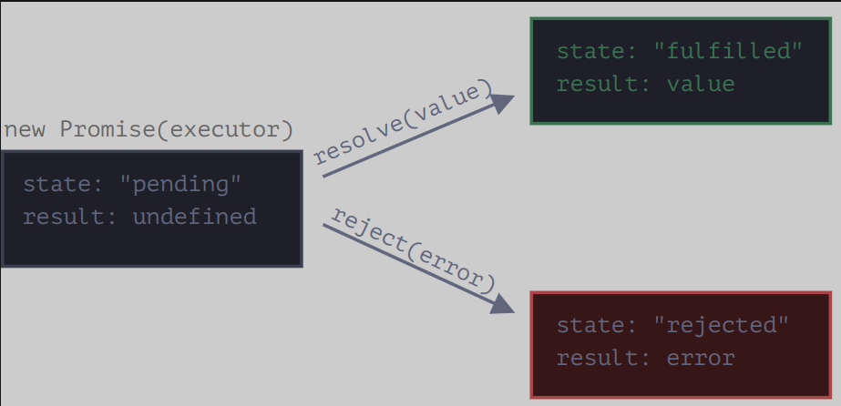

---

### Passing Callbacks into functions vs. Promises

They help bring control of performing callbacks to the developer, instead of external APIs.

Let us take an example to understand this. If we are implementing the logic of an e-commerce website, using regular callbacks:

```javascript
const cart = ["shoes", "pants", "watch"];

createOrder(cart, function(orderId) {
  proceedToPayment(orderId);
})

function proceedToPayment(orderId) {
  // Logic of proceed to payment.
}
```

In this code, we are passing the responsibility of calling the `proceedToPayment` function to the `createOrder` API, whose logic is not known to us.

It is possible that the `createOrder` API has faulty logic and doesn't call our `proceedToPayment` function or it performs multiple calls.

Let us try to improve this code using promises.

```javascript
const cart = ["shoes", "pants", "watch"];

const promise = createOrder(cart);

promise.then(function (orderId) {
  return proceedToPayment(orderId); 
})
```

> ***NOTE:*** Read the reason for writing the `return` keyword over here below, under [Promise Chaining](#pyramid-of-doomcallback-hell-vs-promise-**chaining**).

Now, the `createOrder` API is made to return a `Promise` object, which initially has an `undefined` value.

Using the `Promise.prototype.then` method, we have attached the `proceedToPayment` callback function to the promise object. 

> ***NOTE:*** This is somewhat similar to attaching an event listener to an event.
> 
> In this case, the event is the ***fulfillment*** of the promise.
> 
> Similarly, the `Promise.prototype.catch` method is used to listen for the ***rejection*** of a promise, and subsequently invoking an attached callback function.

Now, the only job of the `createOrder` API is to generate order details and fill the promise object, which is done asynchronously.

Now, upon fulfillment of the promise the callback `proceedToPayment` is invoked with the value of the promise as its argumnet.

So, the control of when the callback function is invoke stays with us.

---

### Pyramid of Doom/Callback Hell vs. Promise Chaining

As seen above, in the case of [Callback Hell](#callback-hell-pyramid-of-doom), our code starts to grow horizontally instead of vertically because of the increased number of callbacks.

Continuing with our e-commerce website example and considering all the functions to be APIs:

```javascript
const cart = ["shoes", "pants", "watch"];

createOrder(cart, function(orderId) {
  proceedToPayment(orderId, function(paymentInfo) {
    showOrderSummary(paymentInfo, function(amountDeducted) {
      updateWalletBalance(amountDeducted);
    })
  })
})
```

We can see that this code is already unmanageable and would be hard to maintain.

If we were assume all these APIs to return Promises (Objects representing the eventual completion or failure of an asynchronous operation), we can chain `Promise.prototype.then` methods and pass each inner API that is dependent on the outer action, as a callback to be executed once the promise it is dependent on is in `fulfilled` state.

```javascript
const cart = ["shoes", "pants", "watch"];

createOrder(cart)
  .then(function (orderId) {
    return proceedToPayment(orderId);
  })
  .then(function (paymentInfo) {
    return showOrderSummary(paymentInfo);
  })
  .then(function (amountDeducted) {
    return updateWalletBalance(amountDeducted);
  });
```

> ***NOTE:*** The **Promises** that are returned by the API calls are returned from inside the callback function as well over here(which is the reason for the presence of the `return` keywords).
> 
> The outcome of not doing this is explained [below](#what-happens-if-we-dont-return-promises-from-callbacks-in-promise-chains).

### What happens if we don't return promises from callbacks in Promise Chains 

If don't return the promises from the callbacks in the Promise chain, like this:
```javascript
const promise0 = new Promise(function (resolve, reject) {
    setTimeout(function () {
        resolve(1);
    }, 5000);
})

promise0
  .then(function () {
      console.log("hello");
  })
  .then(function() {
      console.log("world");
  });
```

All the `.then`/`.catch` blocks would have executed upon fulfillment/rejection of the first promise, instead of waiting for every subsequent promise, being generated in the callback functions to be evaluated. 

This is because the `then`/`catch` methods return a `Promise` object always. If the callback function within them doesn't return a new `Promise` object, then the promise returned by these methods takes on the state (fulfilled/rejected) of the original `Promise` object they were called upon.

> ***NOTE:*** Read about return values of `then` and `catch` methods in detail on [MDN](https://developer.mozilla.org/en-US/docs/Web/JavaScript/Reference/Global_Objects/Promise/then), to truly understand this concept.

So, in the above example, the words "hello" and "world" would be displayed at once, upon fulfillment of the promise `promise0`, because the first `then` method's callback function doesn't return a new `Promise` object, so it's returned `Promise` object takes on the state of `promise0` (fulfilled) instantly, leading to simultaneous displaying of both the word.

Let us take another example:

```javascript
const promise1 = new Promise(function (resolve, reject) {
    setTimeout(function () {
        resolve(1);
    }, 5000);
})

promise1
  .then(function () {
      console.log("hello");

      const promise2 = new Promise(function (resolve, reject) {
          setTimeout(function () {
              resolve(1);
          }, 5000);
      });
      return promise2;
  })
  .then(function() {
      console.log("world");
  });
```

In this code, the first `.then` block returns a new promise, so the `.then` block after it is now called upon on the newly generate promise, instead of on the state of the original promise.

This is why in this code, we would see the word "hello" first (when the promise `promise1` is fulfilled) and the word "world" after approximately 5 seconds of that (when the promise `promise2` is fulfilled).

---

### Inconsistency in Promises in Chromium Based Browsers

Suppose we execute the following script in our chromium based browser's console.
```javascript
const GITHUB_API = "https://api.github.com/users/rohan-verma19";

const user = fetch(GITHUB_API);

console.log(user);
```

We get a somewhat weird result(only reproducible in Chrome):
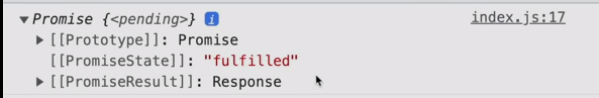

The `console.log` shows that the promise is ***`<pending>`***, but the state inside the promise shows **"fulfilled"** state.

This is because this script was synchronously executed almost instantaneously, and at that time the promise wasn't yet fulfilled. 

But, the values inside the promise object represent the current state of the promise i.e., even if the promise wasn't fulfilled at the time of logging the promise object, we are displayed the updated values of the promise object.

> NOTE: This is only in the case when we try to view the members of the Promise object, ONLY after the promise is resolved. 
> 
> If we somehow view the members of the Promise object before the promise is resolved (by using a [`setTimeout`](#settimeout-web-api-event) API call to delay the resolution of the promise, OR using a debugger), there would be no inconsistency.
>
> This can be verified using the code-snippet [below](#code-snippet-for-understanding-the-intricacies-of-promises).

---

### Code-snippet for understanding the intricacies of Promises

```javascript
const cart = ["shoes", "watch", "ring"];

const promise = createOrder(cart);

console.log(promise);
//! Observe what happens if you try to see the members of the Promise object logged here BEFORE and AFTER the promise is rejected.

promise
  .then(function (orderId) {
      return proceedToPayment(orderId);
  })
  .catch(function (order) {

  })

function createOrder(cart) {
    const prom = new Promise(function (resolve, reject) {
        
        // If card is not valid, promise is REJECTED.
        if(!validateCart(cart)) { 
            const err = new Error("Cart is not valid!");
            reject(err);
        }

        // logic for createOrder

        const orderId = getOrderIdFromDB(cart);

        if(orderId) {
            setTimeout(function () {
                resolve(orderId);
                console.log(prom); 
                // Promise object logged after the promise is resolved, just above.
            }, 5000);
        }
    })

    return prom;
}

function validateCart(cart) {
    if(cart.length) {
        return true;
    }
    else {
        return false;
    }
}

function getOrderIdFromDB(cart) {
    return "12345";
}

function proceedToPayment(orderId) {
    console.log("Payment of order number " + orderId + " **initiated**...");
}
```

---

# `Date` objects in Javascript

JavaScript `Date` objects represent a single moment in time in a platform-independent format. 

`Date` objects contain a Number that represents milliseconds since 1 January 1970 UTC.

## `new Date()` constructor vs. `Date()` function

- Calling `new Date()` (the `Date()` constructor) returns a `Date` object.

  When no parameters are provided, the newly-created `Date` object represents the current date and time as of the time of instantiation.

- Calling the `Date()` function (without the `new` keyword) returns a `string` representation of the current date and time, exactly as `new Date().toString()` does. 

  Any arguments given in a `Date()` function call (without the `new` keyword) are **IGNORED**; regardless of whether it's called with an invalid date string — or even called wth any arbitrary object or other primitive as an argument — it always returns a string representation of the CURRENT date and time.

## Displaying dates using `Date.prototype.toString()`

The Date object overrides the `toString()` method of `Object`. 

`Date.prototype.toString()` returns a string representation of the Date as interpreted in the local timezone, containing both the date and the time.

## Methods of `Date` objects

- `Date.prototype.getFullYear()` – Provides current year like 2022.
- `Date.prototype.getMonth()` – Provides current month values 0-11. Where 0 for Jan and 11 for Dec. So add +1 to get the result.
- `Date.prototype.getDate()` – Provides day of the month values 1-31.
- `Date.prototype.getHours()` – Provides current hour between 0-23.
- `Date.prototype.getMinutes()` – Provides current minutes between 0-59.
- `Date.prototype.getSeconds()` – Provides current seconds between 0-59.

# DOM (Document Object Model)

The Document Object Model (DOM) is the data representation of the objects that comprise the structure and content of a document on the web.

As an object-oriented representation of the web page, it can be modified with a scripting language such as JavaScript.

The DOM is not a programming language, but without it, the JavaScript language wouldn't have any model or notion of web pages, HTML documents, SVG documents, and their component parts. 

The document as a whole, the head, tables within the document, table headers, text within the table cells, and all other elements in a document are parts of the document object model for that document. 

They can all be accessed and manipulated using the DOM and a scripting language like JavaScript.

---

## `window.document`

`window.document` is a property of the `window` object returns a reference to the `document` object contained in the window.

### `document` object

The `document` object represents any web page loaded in the browser and serves as an entry point into the web page's content, which is the DOM tree.

### `window.document.forms`

The `forms` read-only property of the `document` interface returns an [HTMLCollection](#what-is-an-htmlcollection) object listing all of the document's forms. 

Each item in the collection is a `HTMLFormElement` representing a single `<form>` element in the DOM. I

It allows access to—and, in some cases, modification of—aspects of the form, as well as access to its component elements.

Just like other [HTMLCollection](#what-is-an-htmlcollection)) objects, we can access each individual `HTMLFormElement` using its index position.

### `window.document.links`

The links read-only property of the `document` interface returns an [HTMLCollection](#what-is-an-htmlcollection)) of all `<area>` elements and `<a>` elements in a document with a value for the `href` attribute.

This is useful for extracting all the links from a web page.

### `window.document.images`

TODO

### `window.document.scripts`

TODO

### `window.document.getElementsByTagName(<name>)`

The `getElementsByTagName` method of `Document` interface returns an [HTMLCollection](#what-is-an-htmlcollection) of all elements with the given tag name.

`<name>` : A string representing the name of the elements. The special string `*` represents all elements.

For example
```javascript
document.getElementsByTagName("span");
document.getElementsByTagName("*");
```

### `window.document.getElementById(<name>)`

The `getElementById()` method returns an element with a specific ID. If an ID isn't unique, it returns the first occurrence.

The `getElementById()` method returns null if the element does not exist.

The `getElementById()` method is one of the most common methods in the HTML DOM. It is used almost every time you want to read or edit an HTML element.

```javascript
document.getElementById("demo");
```

<!-- ### `window.document.all` -->
<!-- DEPRECATED -->

---

### Locating DOM Elements using *complex* CSS Selectors (**Selectors API**)

The **Selectors API** provides methods that make it quick and easy to retrieve Element nodes from the DOM by matching against a set of selectors. 

The methods of **Selectors API** accept any CSS selector, so you are no longer limited by selecting elements by `id`.

> **NOTE:** Before we get into Element Selectors, it is important to note that CSS Pseudo-classes can't be used to select elements because as indicated by the name, pseudo-classes don't actually exist in the DOM Tree.
> 
> Since, these are NOT represented in the DOM tree, these can't be accessed by methods of **Selectors API**.

The methods of the Selector API are also prototype methods of the [`Element`](#element-interface) interface, which means that we can use these methods with the return values of [`getElementById()`](#windowdocumentgetelementbyidname), etcetera.

#### `<selectors>` argument of Selector API methods

Selectors to determine what element or elements should be returned. 

This includes selector lists so you can group multiple selectors in a single query. For example,
```css
element, element, element { style properties }
```  

Only elements can be selected, pseudo-classes are not supported.

> **NOTE:** If the specified selectors include a CSS pseudo-element, the returned list/element is always EMPTY.

#### `window.document.querySelector(<selectors>)` OR `Element.prototype.querySelector(<selectors>)`

- Return value: An [Element](#element-interface) object representing the first element in the document that matches the specified set of CSS selectors, or null is returned if there are no matches.

#### `window.document.querySelectorAll(<selectors>)` OR `Element.prototype.querySelectorAll(<selectors>)`

- Return value : A non-live [NodeList](#nodes-in-dom) containing one [Element](#element-interface) object for each descendant node that matches at least one of the specified selectors.

---

## What is an HTMLCollection?

The HTMLCollection interface represents a generic collection of elements in document order and offers methods and properties for selecting from the list.

It is an [`Array`-like object](#what-is-an-array-like-object) similar to [arguments](#arguments-object).

HTMLCollection items can be accessed by their name, id, or index number.

An HTMLCollection in the HTML DOM is live; it is automatically updated when the underlying document is changed. 

For this reason it is a good idea to make a copy (eg. using Array.from) to iterate over if adding, moving, or removing nodes.

### Creating an Array from an HTMLCollection

We can make use of the [`Array.from()`](#arrayfrom) method to create an array from an HTMLCollection.

```javascript
let htmlCollection = document.getElementsByTagName("*");
let arr = Array.from(htmlCollection);
```

This is helpful as then we can use built-in Array methods with the data obtained. For example:

```javascript
arr.forEach(function (element) {
  window.console.log(element);
})
```

---

## Nodes in DOM

In the DOM, all parts of the document, such as elements, attributes, text, etc. are organized in a hierarchical tree-like structure; where each node can have a parent, a list of child nodes and a `nextSibling` and `previousSibling`.

These individual parts of the document are known as nodes.


---

### Types of Nodes (`Node.nodeType` property)

The read-only `nodeType` property of a `Node` interface is an integer that identifies what the node is. 

It distinguishes different kind of nodes from each other, such as **elements**, **text** and **comments**.

#### (`Node.ELEMENT_NODE`) or (`nodeType` = 1)

`Node.ELEMENT_NODE` always returns 1.

When `nodeType` of a particular node is 1, it is an [Element](#element-interface) node, like `<p>` or `<div>`.

#### (`Node.ATTRIBUTE_NODE`) or (`nodeType` = 2)

`Node.ATTRIBUTE_NODE` always returns 2.

We know that attributes (key-value pairs) such as `padding`, `margin`, etc, are also represent as Nodes in the DOM.

When `nodeType` of a particular node is 2, it is an [`Attribute`](#attr-interface) of an [`Element`](#element-interface).

#### (`Node.TEXT_NODE`) or (`nodeType` = 3)

`Node.TEXT_NODE` always returns 3.

The actual [`Text`](#text-interface) inside an [`Element`](#element-interface) or [`Attr`](#attr-interface) or the whitespaces/line-breaks between two HTML tags.

#### (`Node.COMMENT_NODE`) or (`nodeType` = 8)

`Node.COMMENT_NODE` always returns 8.

A Comment node, such as `<!-- … -->`.

---

### `Node.nodeName`

It returns the name of the `nodeType`.

---

### `Node.childNodes` property

The `childNodes` property returns a collection (list) of an elements's child nodes (`nodeType`: [1](#nodeelement_node-or-nodetype--1), [3](#nodetext_node-or-nodetype--3) and [8](#nodecomment_node-or-nodetype--8)).

It returns a read-only `NodeList` object. `childNodes[0]` is the same as `firstChild`.

---

### `Node.children` property

`children` returns child [elements](#nodeelement_node-or-nodetype--1) (not [text](#nodetext_node-or-nodetype--3) and [comment](#nodecomment_node-or-nodetype--8) nodes).

It returns an `HTMLCollection` object.

### `Node.childElementCount` property

It returns the count of the child [elements](#nodeelement_node-or-nodetype--1).

---

### Changing the text of a node

When you **set** the `innerText` or the `textContent` property of an element, all child nodes are removed and replaced by only one new text node.

#### `Node.innerText` vs. `Node.textContent`

- The `innerText` property of the `Node` interface represents the RENDERED text content of a node and its descendants.

- The `textContent` property of the Node interface represents raw textual content inside a node and its descendants.

```html
<div id="t"><div>lions,
tigers</div><div style="visibility:hidden">and bears</div></div>
```

Here, `innerText` would yield "`lions, tigers`" and `textContent` would yield "`lions,\ntigersand bears`".

Notice the differences, 
1. The elements that are not rendered are also not present in `innerText`. 
2. The line-breaks in `innerText` follow the line breaks that were introduced by layout (not the original text we stuffed in the DOM). 

The best way to think about `innerText` is that it is roughly what you would get if you selected the text and copied. 

Whereas, `textContent` is just a concatenation of the values of all [Text nodes](#nodetext_node-or-nodetype--3) in the sub-tree.

The key takeaway is that `innerText` requires some information from the layout system to determine how the text is being presented to the user. This is what makes `innerText` one of those properties that can cause the PERFORMANCE of your app to go off the rails.

---

## Removing & Replacing Nodes

### `Element.replaceWith()`

The `replaceWith()` method replaces the ChildNode in the children list of its parent with another Node or string objects. 

Here is an example:
```javascript
let element1 = document.getElementById("myId");
let element2 = document.createElement("h1");
let content = document.createTextNode("Added Content");
element2.appendChild(content); 
element1.replaceWith(element2);
```

- We are getting and element using its id `myId`. 

- Then we are creating a new heading element.
  
- In the next step, we are adding the content to the `element2` and finally, we are replacing the old element, with the newly created element. 
  
The element with ID `myId` is stored as a [**reference**](#values-vs-references-in-javascript) in `element1` which is we are able to manipulate it using the `element1` identifier. 

TODO : If in case we wished to stored the [**value**](#values-vs-references-in-javascript) of the element.

### `Node.replaceChild()`

The `replaceChild()` method replaces a child node with a new node. 

We can create a new node, or the new node could be an existing node in the document or the new node could be an existing node in the document.

### `Node.removeChild()`

This method removes a specified child node of the specified element. 

It will return the removed node as a [Node](#nodes-in-dom) object, or null if the node does not exist. 

Remember that the removed child node is no longer part of the DOM. 

---

## Interfaces in DOM

### Inheritance Tree


### `Element` interface

`Element` is the most general base class from which all element objects (i.e. objects that represent elements) in a `Document` inherit. 

It only has methods and properties common to all kinds of elements.

For instance, elements like `<p>`, `<div>`, `<span>` when represented in the DOM, inherit from `Element`.

#### `HTMLElement` interface

The `HTMLElement` interface represents any HTML element. 

Some elements directly implement this interface, while others implement it via an interface that inherits it.

### `Attr` interface

The `Attr` interface represents one of an element's attributes as an object, which is a node in the DOM tree. 

The core idea of an object of type `Attr` is the association between a **name** and a **value**. An attribute may also be part of a namespace and, in this case, it also has a URI identifying the namespace, and a prefix that is an abbreviation for the namespace.

In most situations, you will directly retrieve the attribute value as a string (e.g., `Element.getAttribute()`), but certain functions (e.g., `Element.getAttributeNode()`) or means of iterating return `Attr` instances.

For instance, attributes like `padding: none`, when represented in the DOM, inherit from `Attr`.

### `Text` interface

The `Text` interface represents a text node in a DOM tree.

To understand what a text node is, consider the following document:
```html
<html class="e"><head><title>Aliens?</title></head>
<body>Why yes.
</body>

</html>
```
In this document, there are 4 text nodes, with the following contents:

- "`Aliens?`" (the contents of the `title` element)
- "`\n`" (after the `</head>` end tag, a newline)
- "`Why yes.\n`" (the contents of the `body` element)
- "`\n\n`" (after the `</body>` tag)

### `Comment` interface

The `Comment` interface represents textual notations within markup; although it is generally not visually shown, such comments are available to be read in the source view.

Comments present in HTML documents inherit from `Comment` when represented in a DOM tree.

---

## Creating, Removing & Replacing Elements

### `document.createElement()`

The `document.createElement()` is a method used to create an HTML element. 

For instance, this creates a new `<div>` element:

```javascript
let div = document.createElement('div');
```

### `document.createTextNode()`

This method creates a [Text Node](#nodetext_node-or-nodetype--3) with the specified text. 

### `document.appendChild()`

Appending in JavaScript is a way to insert content to the end of already existing elements. 

To append in Javascript, we use the `appendChild()` method. 

---

Using the last 3 commands in combination:

We use the `createElement()` method to create an element Node with the specified name. 

We also create a text node using `createTextNode()`, which we append to the created element using the `element.appendChild()`.

```javascript
var paragraph = document.createElement("p");                
var text = document.createTextNode("This is a paragraph.");       
paragraph.appendChild(text);  
```

---

## Working with Attributes

JavaScript provides us with several methods for adding, removing or changing an HTML [`Element`](#element-interface) attribute. 

### `Element.setAttribute()`

The `setAttribute()` method is used to set an attribute on the specified element. 

Using this method, a new attribute is added with the specified name and value. If the attribute already exists on the element, the value is updated. 

Here is an example:

```javascript
document.getElementById("myAnchor").setAttribute("href", "https://codewithharry.com/");
```
### `Element.getAttribute()`

The `getAttribute()` method is used to get the current value of a attribute on the specified element. 

If the attribute does not exist on the element, it will return null. 

This method returns a Boolean value that indicates if the element has the specified attribute. If the element contains an attribute, it will return true; otherwise, it will return false. Here is an example:

In this example, we find that if the `<button>` element has an `onclick` attribute:

```javascript
var h = document.getElementById("Btn").hasAttribute("onclick");
```

### `Element.removeAttribute()`

The `removeAttribute()` method is used to remove an attribute from the specified element. 

The difference between this method and the `removeAttributeNode()` method is that the `removeAttributeNode()` method removes the specified [Attr](#attr-interface) object, while this method removes the attribute with the specified name. 

The result will be the same. 

BUT, this method has no return value, while the `removeAttributeNode()` method returns the removed attribute as an [Attr](#attr-interface) object.

Remove the href attribute from an `<a>` element:

```javascript
document.getElementById("myAnchor").removeAttribute("href");
```

---

# Events in Javascript

Events are actions or occurrences that happen in the system you are programming, which the system tells you about so your code can react to them.

The `Event` interface represents an event which takes place in the DOM. 

There are many types of events, some of which use other interfaces based on the main `Event` interface. 


`Event` itself contains the properties and methods which are common to all events.

In simple words, HTML events are "things" that happen to HTML elements.

When JavaScript is used in HTML pages, JavaScript can "react" on these events.

## Event Listeners vs. Event Handlers

- Event listener listens out for the event happening.
- Event handler is the code that is run in response to it happening.

## `addEventListener()` method

The `addEventListener()` method attaches an event handler to the specified element. The `addEventListener()` method can have multiple event handlers applied to the same element. It doesn’t overwrite other event handlers.

The recommended mechanism for adding event handlers in **web-pages** is the `addEventListener()` method.

Inside the `addEventListener()` function, we specify two parameters: 
- the name of the event we want to register this handler for.
- the code that comprises the handler function we want to run in response to it.

## `KeyboardEvent` objects

`KeyboardEvent` objects describe a user interaction with the keyboard; each event describes a single interaction between the user and a key (or combination of a key with modifier keys) on the keyboard.

### Keyboard Event Attributes

The following event **Attributes** can be added to HTML elements to define actions for events related to the keyboard.

- (`Key` = *Value*) - Attribute Description
- (`onkeydown` = *script*/*function*) - Fires when a user is pressing a key.

  The `keydown` event fires multiple times if a user presses and holds a key.

- (`onkeyup` = *script*/*function*) - Fires when a user releases a key.

  The `keyup` event fires only once when user releases the key.

For instance,

```html
<input type="text" onkeydown="myFunction()">
```

OR (in javascript)

```javascript
document.body.input.onkeydown = function(event) {
    console.log(event);
  };
```

---

### Handling Keyboard Events using `addEventListener()` and `KeyboardEvent` objects' properties

Note that simply removing the prefix `on` from the HTML event attribute values, gives us events which we can use with `addEventListener()` method. For example: `onkeydown` -> `keydown`.

We mainly use two properties of the `KeyboardEvent` objects:

---

- `KeyboardEvent.key` : This property of the event object allows to get the character. 
  
  This will be useful in the cases like differentiating between `F` and `f`, as well as detecting when we press the `=` key in combination with shift, which would make it `+`.

  However, `ShiftLeft` and `ShiftRight` would both have `key`property as `Shift`.

  ```javascript
  document.addEventListener("keydown", function(event) {
      if (event.key === " ") {
        console.log("Space bar pressed.");
      }
      else if (event.key === "F") {
        console.log("Uppercase F.");
      }
      else if (event.key === "ArrowLeft") {
        console.log("Left arrow key pressed.");
      }
  } )
  ```

---

- `KeyboardEvent.code` : This property of the event object allows to get the physical key code. 
  
  This will be useful in the cases where we want to differentiate between `ShiftLeft` and `ShiftRight`. 
  
  But this won't allow us to differentiate between `F` and `f`, because both of them would have `code` property as `KeyF`.

  ```javascript
  document.addEventListener("keyup", function(event) {
      if (event.code === "ShiftLeft") {
        console.log("Left shift pressed.");
      }
      else if (event.key === "AltRight") {
        console.log("Right alt pressed.");
      }
      else if (event.key === "f") {
        console.log("Lowercase F");
      }
  } )
  ```

---

## `MouseEvent` objects

The `MouseEvent` interface represents events that occur due to the user interacting with a pointing device (such as a mouse). Common events using this interface include click, dblclick, mouseup, mousedown

### Mouse Event Attributes

The following are some of the event **Attributes** can be added to HTML elements to define actions for events related to the keyboard. A comprehensive list can be accessed over [here](https://www.w3schools.com/tags/ref_eventattributes.asp).

- (`Key` = *Value*) - Attribute Description
- (`onclick` = *script*/*function*) - Fires on a mouse click on the element.
- (`ondblclick` = *script*/*function*) - Fires on a mouse double-click on the element.
- (`onwheel` = *script*/*function*) - Fires when the mouse wheel rolls up or down over an element

For instance,

```html
<button type="text" onclick="myFunction()">
```

OR (in javascript)

```javascript
button.onclick = function(event) {
    if (event.altKey && event.shiftKey) {
      alert('Hooray!');
    }
  };
```

---

### Handling Mouse Events using `addEventListener()` and `MouseEvent` objectss properties

Note that simply removing the prefix on from the HTML event attribute values, gives us events which we can use with `addEventListener()` method. For example: `onwheel` -> `wheel`.

# ES6 (ECMAScript 6) Features

## Arrow Functions


## Rest Parameters

TODO

## `let`, `const` keywords & **Temporal Dead Zones**

Given under [Variable and Constant values](#variable-and-constant-values) above.

# Unexpected Behaviors in Javascript

## Increasing the length of an `Array`

Suppose we run the following code:
```javascript
let array = [1, 2, 3];

let index = 0;
while(true) {
  array[index] = index;
  
  console.log(array[index]);
  
  index++;
}
```

In other strongly-types languages, for example C++, this would throw a segmentation fault error once we went out of the range of the memory allocated to `array`.

However, in Javascript, this would trigger an infinite loop, **endlessly increasing the number of elements** in `array`.

The output of this snippet would be something like this:
```
0
1
2
3
4
5
6
7
8
9
10
11
12
13
14
...
...
... until manual interruption
```

In order to prevent this, we should ALWAYS set an upper bound of the number of elements.

# TODO

## Interfaces in TypeScript (mentioned in MDN)

In TypeScript, an interface is an abstract type that tells the compiler which property names a given object can have. TypeScript creates implicit interfaces when you define an object with properties. It starts by looking at the object's property name and data type using TypeScript's type inference abilities.

If we think about it in terms of OOPs, it can be considered as a class. Objects can be instantiated from this class.

`Interfaces` aren't available in JavaScript but in documentation relating to DOM, `Interfaces` are mentioned since TypeScript is also a popular scripting language used nowadays.

[Here](https://developer.mozilla.org/en-US/docs/Web/API/Window) is an example of the use of the word `Interface`.