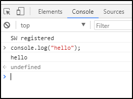
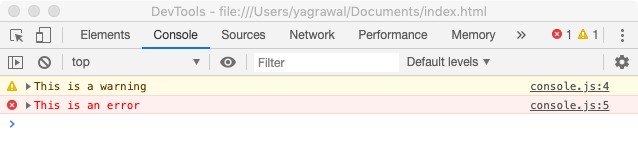
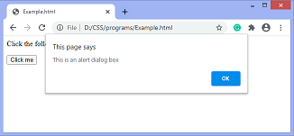
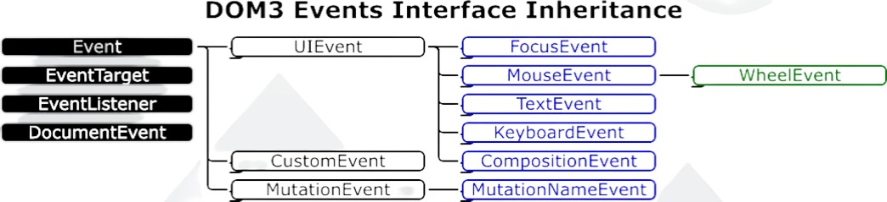

- [Important Information relating to Web Browsers](#important-information-relating-to-web-browsers)
  - [What is a Session?](#what-is-a-session)
  - [User Agent](#user-agent)
    - [User Agent string](#user-agent-string)
  - [Running a method in the Browser Console](#running-a-method-in-the-browser-console)
- [Important Objects and Methods related to Web Browsers](#important-objects-and-methods-related-to-web-browsers)
  - [`console` object](#console-object)
    - [`console.log(<arg>)` method](#consolelogarg-method)
    - [`console.table(<arg>)` method](#consoletablearg-method)
    - [`console.warn(<arg>)` and `console.error(<arg>)` method](#consolewarnarg-and-consoleerrorarg-method)
    - [`console.time(<arg>)` and `console.timeEnd(<arg>)`;](#consoletimearg-and-consoletimeendarg)
    - [`console.clear()` method](#consoleclear-method)
  - [`window` object and "context"](#window-object-and-context)
    - [Usage of `window.console` object](#usage-of-windowconsole-object)
    - [Useful properties of the `window` object](#useful-properties-of-the-window-object)
      - [`window.innerWidth`](#windowinnerwidth)
      - [`window.innerHeight`](#windowinnerheight)
      - [`window.scrollX`](#windowscrollx)
      - [`window.scrollY`](#windowscrolly)
      - [`window.history`](#windowhistory)
        - [`window.history.length`](#windowhistorylength)
        - [`window.history.back()` or `window.history.forward()` or `window.history.go()`](#windowhistoryback-or-windowhistoryforward-or-windowhistorygo)
      - [`window.location`](#windowlocation)
        - [`window.location.href` vs. `window.location.assign` vs. `window.location.replace()`](#windowlocationhref-vs-windowlocationassign-vs-windowlocationreplace)
          - [`window.location.href` property](#windowlocationhref-property)
          - [`window.location.assign()` method](#windowlocationassign-method)
          - [`window.location.replace()` method](#windowlocationreplace-method)
        - [`window.location.reload()`](#windowlocationreload)
        - [`window.location.toString()`](#windowlocationtostring)
          - [What is a stringifier method?](#what-is-a-stringifier-method)
    - [`window.document`](#windowdocument)
    - [Other methods of `window` object](#other-methods-of-window-object)
      - [`window.prompt()` or `prompt()`](#windowprompt-or-prompt)
      - [`window.confirm()` or `confirm()`](#windowconfirm-or-confirm)
      - [`window.alert(<arg>)` or `alert(<arg>)`](#windowalertarg-or-alertarg)
- [General information about JavaScript](#general-information-about-javascript)
  - [Data types](#data-types)
  - [`string` data-type](#string-data-type)
    - [Creating a string from other datatypes](#creating-a-string-from-other-datatypes)
    - [Prototype and Static methods of the global `String` object](#prototype-and-static-methods-of-the-global-string-object)
    - [`String.prototype.includes()`](#stringprototypeincludes)
  - [`undefined` data type](#undefined-data-type)
  - [Interfaces (Not available in JavaScript)](#interfaces-not-available-in-javascript)
  - [Objects](#objects)
  - [Prototypes](#prototypes)
  - [Arrays](#arrays)
    - [Structure of created array objects](#structure-of-created-array-objects)
    - [Accessing elements at specific indices of an array](#accessing-elements-at-specific-indices-of-an-array)
    - [What is an `Array`-like object?](#what-is-an-array-like-object)
    - [Some prototype/static methods of the global `Array` class](#some-prototypestatic-methods-of-the-global-array-class)
      - [`Array.prototype.forEach()`](#arrayprototypeforeach)
      - [Creating an array from other sequences using: `Array.from()`](#creating-an-array-from-other-sequences-using-arrayfrom)
  - [Variable and Constant values](#variable-and-constant-values)
    - [`let` & `var` keywords for variables](#let--var-keywords-for-variables)
    - [`const` keyword for constants](#const-keyword-for-constants)
  - [Template literals and string interpolation in Javascript](#template-literals-and-string-interpolation-in-javascript)
  - [Ending statements with semi-colons](#ending-statements-with-semi-colons)
- [Functions in Javascript](#functions-in-javascript)
  - [Function DECLARATION vs Function EXPRESSION](#function-declaration-vs-function-expression)
    - [a. Function DECLARATION](#a-function-declaration)
    - [b. Function EXPRESSION](#b-function-expression)
  - [`arguments` object](#arguments-object)
  - [No Parameters vs. Default Parameters](#no-parameters-vs-default-parameters)
  - [call method of 'global Function class'](#call-method-of-global-function-class)
  - [Object Construction function](#object-construction-function)
  - [Callback functions](#callback-functions)
  - [`this` object of functions](#this-object-of-functions)
  - [Immediately Invoked Function Expression (`IIFE`)](#immediately-invoked-function-expression-iife)
    - [Use-case of an `IIFE`](#use-case-of-an-iife)
- [DOM (Document Object Model)](#dom-document-object-model)
  - [`window.document`](#windowdocument-1)
    - [`document` object](#document-object)
    - [`window.document.forms`](#windowdocumentforms)
    - [`window.document.links`](#windowdocumentlinks)
    - [`window.document.images`](#windowdocumentimages)
    - [`window.document.scripts`](#windowdocumentscripts)
    - [Element Selectors](#element-selectors)
      - [`window.document.getElementsByTagName(<name>)`](#windowdocumentgetelementsbytagnamename)
      - [`window.document.getElementById(<name>)`](#windowdocumentgetelementbyidname)
  - [What is an HTMLCollection?](#what-is-an-htmlcollection)
    - [Creating an Array from an HTMLCollection](#creating-an-array-from-an-htmlcollection)
  - [Nodes in DOM](#nodes-in-dom)
    - [Types of Nodes (`Node.nodeType` property)](#types-of-nodes-nodenodetype-property)
      - [(`Node.ELEMENT_NODE`) or (`nodeType` = 1)](#nodeelement_node-or-nodetype--1)
      - [(`Node.ATTRIBUTE_NODE`) or (`nodeType` = 2)](#nodeattribute_node-or-nodetype--2)
      - [(`Node.TEXT_NODE`) or (`nodeType` = 3)](#nodetext_node-or-nodetype--3)
      - [(`Node.COMMENT_NODE`) or (`nodeType` = 8)](#nodecomment_node-or-nodetype--8)
    - [`Node.nodeName`](#nodenodename)
    - [`Node.childNodes` property](#nodechildnodes-property)
    - [`Node.children` property](#nodechildren-property)
    - [`Node.childElementCount` property](#nodechildelementcount-property)
    - [Changing the text of a node](#changing-the-text-of-a-node)
      - [`Node.innerText` vs. `Node.textContent`](#nodeinnertext-vs-nodetextcontent)
  - [Removing & Replacing Nodes](#removing--replacing-nodes)
    - [`Element.replaceWith()`](#elementreplacewith)
    - [`Node.replaceChild()`](#nodereplacechild)
    - [`Node.removeChild()`](#noderemovechild)
  - [Interfaces in DOM](#interfaces-in-dom)
    - [Inheritance Tree](#inheritance-tree)
    - [`Element` interface](#element-interface)
      - [`HTMLElement` interface](#htmlelement-interface)
    - [`Attr` interface](#attr-interface)
    - [`Text` interface](#text-interface)
    - [`Comment` interface](#comment-interface)
  - [Creating, Removing & Replacing Elements](#creating-removing--replacing-elements)
    - [`document.createElement()`](#documentcreateelement)
    - [`document.createTextNode()`](#documentcreatetextnode)
    - [`document.appendChild()`](#documentappendchild)
  - [Working with Attributes](#working-with-attributes)
    - [`Element.setAttribute()`](#elementsetattribute)
    - [`Element.getAttribute()`](#elementgetattribute)
    - [`Element.removeAttribute()`](#elementremoveattribute)
- [Event](#event)
  - [Event Listeners vs. Event Handlers](#event-listeners-vs-event-handlers)
  - [`addEventListener()` method](#addeventlistener-method)
  - [`KeyboardEvent` objects](#keyboardevent-objects)
    - [Keyboard Event Attributes](#keyboard-event-attributes)
    - [Handling Keyboard Events using `addEventListener()` and [`KeyboardEvent`](#keyboardevent-object) objects' properties](#handling-keyboard-events-using-addeventlistener-and-keyboardevent-objects-properties)
  - [`MouseEvent` objects](#mouseevent-objects)
    - [Mouse Event Attributes](#mouse-event-attributes)
    - [Handling Mouse Events using `addEventListener()` and [`MouseEvent`](#keyboardevent-object) objects' properties](#handling-mouse-events-using-addeventlistener-and-mouseevent-objects-properties)
- [ES6 (ECMAScript 6) Features](#es6-ecmascript-6-features)
  - [Arrow Functions](#arrow-functions)
  - [Rest Parameters](#rest-parameters)
  - [`let` and `const` keywords](#let-and-const-keywords)
- [TODO](#todo)
  - [Interfaces in TypeScript (mentioned in MDN)](#interfaces-in-typescript-mentioned-in-mdn)

# Important Information relating to Web Browsers

## What is a Session?

Session refers to a visitor's time browsing a web site. 

It's meant to represent the time between a visitor's first arrival at a page on the site and the time they stop using the site.

## User Agent 

A user agent is a computer program representing a person, for example, a browser in a Web context.

Besides a browser, a user agent could be a bot scraping webpages, a download manager, or another app accessing the Web. 

Along with each request they make to the server, browsers include a self-identifying User-Agent HTTP header called a [user agent (UA) string](#user-agent-string). This string often identifies the browser, its version number, and its host operating system.

### User Agent string

The user agent string can be accessed with JavaScript on the client side using the `NavigatorID.userAgent` property.

A typical user agent string looks like this: 
```
Mozilla/5.0 (X11; Ubuntu; Linux x86_64; rv:35.0) Gecko/20100101 Firefox/35.0
```

## Running a method in the Browser Console



As we can see, the line just below `console.log("hello");` displays the output (`hello`) of the command.

The line below that shows an arrow pointing to the left and `undefined`. This is the return value of the method that was run.

---

# Important Objects and Methods related to Web Browsers

## `console` object

- In the case of node, `console` is a defined object, which is why we can execute its methods along with the prefix `console` in node locally.
- In web browsers, it is a property of the [global `window` object](#window-object-and-context). This is why we can directly access it in web browsers, since they have `window` [context](#window-object-and-context).


A console traditionally refers to a computer terminal where a user may input commands and view output such as the results of inputted commands or status messages from the computer.

All modern browsers have a web console for debugging.

### `console.log(<arg>)` method

The `console.log()` method is used to write messages to this console. For example:
```javascript
let greeting = "hello";
console.log(greeting);
```
`console.log()` makes it easier to see the value inside a variable. That's why it's commonly used for testing/debugging code.

### `console.table(<arg>)` method

This method displays the keys and values of the object passed to it in tabular form.

### `console.warn(<arg>)` and `console.error(<arg>)` method

- `console.warn()` method outputs a warning message to the Web browser's console.
- `console.error()` method output an error message to the Web browser's console.
An example of both is shown below. 


### `console.time(<arg>)` and `console.timeEnd(<arg>)`;

The `console.time()` method starts a timer we can use to track how long an operation takes.

Each timer is given a unique name. 

When we call `console.timeEnd()` with the same name, the browser will output the time, in milliseconds, that elapsed since the timer was started.

Input:
```javascript
console.time("Your code took");
console.log("Hello World");
console.timeEnd("Your code took");
```

Output:
```
Your code took: 4.3919237898ms
```

### `console.clear()` method

This clears the Browser's console.

---

## `window` object and "context"

`window` is a global object representing the browser window in which the script is running, typically on the **client** side. 

Javascript code has access to global variables based on where it's running - browser engine or node. 

I'm calling this global state **context**.

Since `window` is a global object on the client side (web browsers), we can directly use the methods of `window` in our scripts as they will be running in `window` context. 

We can also say that the `window` object is at the top of the scope chain.

It only works in browsers and not in regular scripts running locally using node, because only browsers have window context.

In node, accessing window is meaningless because there's no browser window.

### Usage of `window.console` object

`window.console` returns a reference to the console object which provides access to the browser's debugging console.

In simple words, it checks if the console is available(truthy value) so that we can log next.

In the case of mobile browsers or general code editors, they don't support debugger/console).

Try running this in your browser's console:

```javascript
if( window.console ) {
    window.console.log( open_date );
};
```

### Useful properties of the `window` object

---

#### `window.innerWidth`

The read-only Window property `innerWidth` returns the interior width of the window in pixels. This includes the width of the vertical scroll bar, if present.

---

#### `window.innerHeight`

The read-only `innerHeight` property of the window [interface](#interfaces-in-typescript-mentioned-in-mdn) returns the interior height of the window in pixels, including the height of the horizontal scroll bar, if present.

---

#### `window.scrollX`

The read-only `scrollX` property of the Window **[interface](#interfaces-in-typescript-mentioned-in-mdn)** returns the number of pixels that the document is currently scrolled horizontally.

TODO: Difference between Window [interface](#interfaces-in-typescript-mentioned-in-mdn) and global Window object

---

#### `window.scrollY`

The read-only `scrollY` property of the Window [interface](#interfaces-in-typescript-mentioned-in-mdn) returns the number of pixels that the document is currently scrolled vertically.

---

#### `window.history`

The `window.history` read-only property returns a reference to the `History` object (i.e., the `history` key of the `window` object has value as the `History` object), which provides an interface for manipulating the browser [session](#what-is-a-session) history.

Note that the history refers to the pages visited ONLY in the tab or frame that the current page is loaded in.

It is also referred to as the `History API` in sources like MDN, since `History` object is used to get the session history of the user back to the application made using JavaScript, for manipulation. 


##### `window.history.length`

##### `window.history.back()` or `window.history.forward()` or `window.history.go()`

Moving backward and forward through the user's history is done using the `back()`, `forward()`, and `go()` methods.

- To move backward through history: `window.history.back()`.
This acts exactly as if the user clicked on the `Back` button in their browser toolbar.

- To move forward: `window.history.forward()`.
This acts exactly as if the user clicked on the `Forward` button in their browser toolbar.

- To move to a specific point in history: `window.history.go(integerVal)` loads a specific page from session history. 
  
  The current page's position is 0 and an integer value relative to the current page has to be passed. For example, we can move forward one page by passing 1.

---

#### `window.location`

The `window.location` read-only property returns a reference to the `Location` object ((i.e., the `location` key of the `window` object has value as the `Location` object)), with information about the current location of the document.

It represents the current **URL** of the document being displayed in that window.

Though `window.location` is a read-only `Location` object, we can also assign a string to it. 

This means that you can work with `location` as if it were a string in most cases: `location = http://www.example.com` is a synonym of `location.href = http://www.example.com`. But the latter is preferred.

##### `window.location.href` vs. `window.location.assign` vs. `window.location.replace()`

All three commands are used to redirect the page to another page/website but differ in terms of their impact on the browser history, safety and return values.

###### `window.location.href` property 

It is a property of `window.location` that stores the URL of the current webpage.

On changing the value of `href` property, a user would be navigated to a new URL, i.e. sent to a new webpage. 
  
It adds an item to the history list, so that the user can return to the current page upon clicking the `Back` button. 

It is faster than using the `assign()` method as calling a function is slower than changing the value of the property.

###### `window.location.assign()` method

It is a property of `window.location` that stores a function expression. 

The `assign` function is also used to navigate to a new URL. But it is preferred over updating the `href` property as calling a function is considered safer and more readable.

However, it does not show the current location, it is only used to go to a new location.

The `assign()` method is also preferred over `href` as it allows the user to mock the function and check the URL input parameters while testing, instead of directly assigning a faulty URL to the `href` property.

Unlike the `replace` method, the `assign` method adds a new record to history so that the user can return to the current page upon clicking the `Back` button.

###### `window.location.replace()` method 

It is a property of `window.location` that stores a function expression. 
  
It is used to navigate to a new URL without adding a new record to the history. 

The user won't be able to navigate back to the current page upon clicking the `Back` button.

##### `window.location.reload()`

The `reload()` method reloads the current document. It is the same as clicking the reload button in your browser.

##### `window.location.toString()`

The `window.location.toString()` [stringifier method](#what-is-a-stringifier-method) of the Location interface returns a string containing the whole URL. It is a read-only version of `window.location.href`.

an api is a contract 

###### What is a stringifier method?

An object's stringifier is any attribute or method that is defined to provide a textual representation of the object for use in situations where a string is expected.

---

### `window.document`

More details under [DOM (Document Object Model)](#dom-document-object-model)

---

### Other methods of `window` object

These methods only work on browsers since only browsers have the pre-existing global `window` object.

We can choose to use these methods without the `window` prefix because, as mentioned previously, browsers have `window` [context](#window-object-and-context).

Note that there should be no locally defined function with the same name, otherwise just using the method name would lead to the local function being called.

This is why it is safer to use the methods along with the prefix of `window` to ensure selection of the correct function definition.

---

#### `window.prompt()` or `prompt()`

TODO

---

#### `window.confirm()` or `confirm()`

TODO

---

#### `window.alert(<arg>)` or `alert(<arg>)`

The alert() method displays an alert box with a message and an OK button.

The alert box takes the focus away from the current window, and forces the user to read the message.

For example:



Note that this is not used nowadays. Instead, we use Bootstrap etc, to show beautified alerts.

---

# General information about JavaScript

## Data types

In Javascript, there are only 6 data types defined:

- the primitives (`boolean`, `number`, `string`, `null`, `undefined`) 
- object (the only reference/non-primitive type)

## `string` data-type

Strings in JavaScript are actually objects with indices as keys and the corresponding characters as values for those keys.

### Creating a string from other datatypes

The `String` constructor is used to create a new `String` object. 

When called instead as a function, it performs type conversion to a **primitive string**, which is usually more useful.

String function and String constructor produce different results:

```javascript
const a = new String("Hello world"); // a === "Hello world" is false
const b = String("Hello world");     // b === "Hello world" is true

a instanceof String;         // is true
b instanceof String;         // is false

typeof a // "object"
typeof b // "string"
```

- Here, the **function** produces a string (the primitive type) as promised. 
- However, the constructor produces an instance of the type `String` (an object wrapper) and that's why you rarely want to use the `String` constructor at all.

Conversion into a string is useful for web crawling applications when we wish to convert URLs to strings and perform string manipulation methods like [`includes()`](#stringprototypeincludes) on them.

### Prototype and Static methods of the global `String` object

### `String.prototype.includes()`

The `includes()` method performs a case-sensitive search to determine whether one string may be found within another string, returning true or false as appropriate.

---

## `undefined` data type

- A variable that has not been assigned a value is of type `undefined`. 
- A method or statement also returns `undefined` if the variable that is being evaluated does not have an assigned value. 
- A function returns `undefined` if a value was not returned.

## Interfaces (Not available in JavaScript)

TODO

## Objects

Constructor function: Object()

This creates an empty instance of the global Object class.

## Prototypes

## Arrays

Arrays are not a separate data type, rather they are instances of the global `Array` class, which is an instance of the global `Object` class.

The global `Array` class, like the global `Object` class, has some static methods as well as some prototype methods, defined within it's prototype which are inherited by created arrays, which are instances of the global `Array` class.

### Structure of created array objects

When we create an array, it is an instance of the global `Array` class from which it inherits methods. 

It has indices starting from 0 as its keys, which have the elements at the corresponding indices as properties and another key called `length` which stores the number of elements of the array.
```javascript
let arr = ["a", "b", "c"];
```
The following array has a structure similar to this:
```javascript
arr = {
    0: "a"
    1: "b"
    2: "c"
    length: 3
    [[Prototype]]: Array.__proto__
}
```

```javascript
console.log(Object.keys(arr));
console.log(Object.values(arr));
```
### Accessing elements at specific indices of an array

```javascript
arr.0; //invalid

console.log(arr[0]); //valid
```
The first statement is invalid since identifies can't begin with numbers.

The second statement is valid.

### What is an `Array`-like object?

An `Array`-like object is an object that has a length property and properties indexed from zero, but it doesn't have `Array`'s built-in methods like `forEach()` or `map()`.

### Some prototype/static methods of the global `Array` class

#### `Array.prototype.forEach()`

The `forEach()` prototype method executes a provided function (Arrow/Callback/Inline-callback) once for each array element.

#### Creating an array from other sequences using: `Array.from()`

The `Array.from()` static method creates a new, shallow-copied Array instance from an iterable or [`Array`-like object](#what-is-an-array-like-object).

This is useful for converting `Array`-like objects (e.g. HTMLCollection) into arrays, in order to use prototype methods of the global `Array` object on them.  

---

## Variable and Constant values

### `let` & `var` keywords for variables

```javascript
let example_1;
example_1 = "example string 1";
console.log(example_1);

var example_2;
example_2 = "example string 2";
console.log(example_2);
```
- `let` is block-scoped, sa variable declared with `let` can only be access inside a block of code.
  
  `var` is function-scoped, so a variable declared inside a function with `var` can be used anywhere within a function.
  ```javascript
  // program to print the text
  // variable `funcScope` cannot be used here
  function greet() {
      var funcScope = 'hello';

      // variable `blockScope` cannot be used here
      if(funcScope == 'hello'){
          // variable `blockScope` can be used here
          let blockScope = 'world';
          console.log(funcScope + ' ' + blockScope);
      }

      // variable `blockScope` cannot be used here
      console.log(funcScope + ' ' + blockScope); // error
  }
  // variable `funcScope` cannot be used here

  greet();
  ```
- `let` does not allow to redeclare variables
  
  `var` allows to redeclare variables.
  ```javascript
  let blockScope = 5; // 5
  let blockScope = 3; // error

  var funcScope = 5; // 5
  var funcScope = 3; // 3
  ```
It would be better to use `let` when defining variables since both `let` and `const` have block-level scope, so resolving scopes would be easier and consistent.

### `const` keyword for constants

Values defined using `const` have block-level scope.

If you are sure that the value of a variable won't change throughout the program, it's recommended to use `const` so as to prevent any errors later on due to changing on variables not meant to be changed. 

Note that it isn't possible to declare constants without initializing them.
This is an example of erroneous code:
```javascript
const x;  // Error! Missing initializer in const declaration.
x = 5;
console.log(x)
```

This is correct:
```javascript
const example_2 = "yo";
console.log(example_2);
```

---

## Template literals and string interpolation in Javascript

TODO

## Ending statements with semi-colons

Although ending statements (NOT BLOCKS of code like if-else) with semi-colons is optional in JavaScript, it is best practice to do so in order to avoid any edge-case behaviour where statements place on two different lines are interpreted together.

# Functions in Javascript

In javascript, functions are also objects.

There is a global `Function` class which has static as well as prototype methods.


## Function DECLARATION vs Function EXPRESSION

### a. Function DECLARATION

```javascript
function functionName(paramA, paramB) {
    // Set of statements
}
```

A function declaration also known as a `function statement` declares a function with a function keyword. 

The function declaration must have a function name.

Function declaration does not require a variable assignment as they are standalone constructs and they cannot be nested inside a functional block.

These are executed before any other code.

The function in function declaration can be accessed before and after the function definition, since JavaScript is a compiled language.

For example:
```javascript
(function yo(){
    console.log("This is a functional declaration");
})();
```

### b. Function EXPRESSION

Function Expressions can be assigned to variables/kept as property values in Javascript.

For calling the function expression, we just use the name of the variable it is stored in followed by arguments.

The syntax for creating the assigning and calling the function expression is as follows:
```javascript
var variableName = function (paramA, paramB) {
    // Set of statements
};

variableName(valueA, valueB);
```
OR
```javascript
const objectName = {
  funcEx:  function (paramA, paramB) {
            // Set of statements
  },
  key1: value1
};

objectName.funcEx(valueA, valueB);
```
They can also be used in [IIFE](#immediately-invoked-function-expression-iife)s (which function declarations can be too but it is more appt. 
to use function expressions).

A function EXPRESSION is just a function declaration without the function name.

Function expressions can be stored in a variable assignment.

This is useful as we can conditionally store function expressions in variables. 

So, the function operating can be different based on if a certain condition is met or not.

Function expressions load and execute only when the program interpreter 
reaches the line of code.

```javascript
var calSub = function (x, y) {
    let z = x - y;
    return z;
};
console.log("Subtraction : " + calSub(7, 4));
```

## `arguments` object

`arguments` is an [`Array`-like object](#what-is-an-array-like-object) accessible inside functions that contains the values of the arguments passed to that function.

For example:
```javascript
function func1(a, b, c) {
  console.log(arguments[0]);
  // expected output: 1

  console.log(arguments[1]);
  // expected output: 2

  console.log(arguments[2]);
  // expected output: 3
}

func1(1, 2, 3);
```

## No Parameters vs. Default Parameters

In JavaScript, function parameters default to [`undefined` data type](#undefined), if no parameters are provided. 

Suppose we have the following code:
```javascript
function print_message(message) {
console.log("Message is : " message);
};
print_message();
```
The output would be:
```
Message is : undefined
```

However, it's often useful to set a different default value. This is where default parameters can help.

```javascript
function functionName(param = defVal) {
// function body
};
```
Here `defVal` is the default value for the argument `param`.

## call method of 'global Function class'

TODO

## Object Construction function

TODO

## Callback functions

A callback function is a function passed into another function as an argument, which is then invoked inside the outer function to do some kind of routine or action.

## `this` object of functions

'this' object of a function is by-default 'undefined'.

We can manipulate its properties etc and use it to create more objects with the help of constructor functions.

## Immediately Invoked Function Expression (`IIFE`)


`IIFE`, Immediately Invoked Function Expression, is a JavaScript function that runs as soon as it is defined.

It is a design pattern which is also known as a **Self-Executing Anonymous Function** and contains two major parts:

- The first is the function expression (no-name function).

    Note that we can provide a named function (FUNCTION DEFINITION) over here as well with [lexical scope](#meaning-of-lexical-scope) enclosed within the Grouping Operator `()`.

    Even though we can use both function definitions and expressions in IIFEs, we should use definitions anyway to make our code more readable. 

    ##### Meaning of lexical scope

    The ability where the inner function can access the parent function scope is known as **lexical scope**.

    This prevents accessing variables within the IIFE idiom as well as polluting the global scope.

- The second part creates the immediately invoked function expression () through which the JavaScript engine will directly interpret the function.

For example:
```javascript
(function IIFE() {
    console.log("This is an IIFE");
    //variables defined here can't be accessed outside but they can be accessed by functions defined inside this function.
    })() // the function is immediately invoked  
```

Check out [20B-IIFE.js](./workshopper-javascripting-scripts/20B-IIFE.js) for an example implementation of IIFEs.

### Use-case of an `IIFE`

- When we don't want to re-use the code of the function and don't want to add to the already extensive global namespace, so the functions of an `IIFE` can't be called externally. 

    This is why we can use function expressions (no-name functions) since we don't have to call it later on. 

    However, we can still name it (use function declaration) in order to organize our code.

* It is a common pattern for creating local scopes.  

# DOM (Document Object Model)

The Document Object Model (DOM) is the data representation of the objects that comprise the structure and content of a document on the web.

As an object-oriented representation of the web page, it can be modified with a scripting language such as JavaScript.

The DOM is not a programming language, but without it, the JavaScript language wouldn't have any model or notion of web pages, HTML documents, SVG documents, and their component parts. 

The document as a whole, the head, tables within the document, table headers, text within the table cells, and all other elements in a document are parts of the document object model for that document. 

They can all be accessed and manipulated using the DOM and a scripting language like JavaScript.

---

## `window.document`

`window.document` is a property of the `window` object returns a reference to the `document` object contained in the window.

### `document` object

The `document` object represents any web page loaded in the browser and serves as an entry point into the web page's content, which is the DOM tree.

### `window.document.forms`

The `forms` read-only property of the `document` interface returns an [HTMLCollection](#what-is-an-htmlcollection) object listing all of the document's forms. 

Each item in the collection is a `HTMLFormElement` representing a single `<form>` element in the DOM. I

It allows access to—and, in some cases, modification of—aspects of the form, as well as access to its component elements.

Just like other [HTMLCollection](#what-is-an-htmlcollection)) objects, we can access each individual `HTMLFormElement` using its index position.

### `window.document.links`

The links read-only property of the `document` interface returns an [HTMLCollection](#what-is-an-htmlcollection)) of all `<area>` elements and `<a>` elements in a document with a value for the `href` attribute.

This is useful for extracting all the links from a web page.

### `window.document.images`

TODO

### `window.document.scripts`

TODO

---

### Element Selectors

<!-- ### `window.document.all` -->
<!-- DEPRECATED -->

#### `window.document.getElementsByTagName(<name>)`

The `getElementsByTagName` method of `Document` interface returns an [HTMLCollection](#what-is-an-htmlcollection) of all elements with the given tag name.

`<name>` : A string representing the name of the elements. The special string `*` represents all elements.

For example
```javascript
document.getElementsByTagName("span");
document.getElementsByTagName("*");
```

#### `window.document.getElementById(<name>)`

The `getElementById()` method returns an element with a specific ID. If an ID isn't unique, it returns the first occurrence.

The `getElementById()` method returns null if the element does not exist.

The `getElementById()` method is one of the most common methods in the HTML DOM. It is used almost every time you want to read or edit an HTML element.

```javascript
document.getElementById("demo");
```

---

## What is an HTMLCollection?

The HTMLCollection interface represents a generic collection of elements in document order and offers methods and properties for selecting from the list.

It is an [`Array`-like object](#what-is-an-array-like-object) similar to [arguments](#arguments-object).

HTMLCollection items can be accessed by their name, id, or index number.

An HTMLCollection in the HTML DOM is live; it is automatically updated when the underlying document is changed. 

For this reason it is a good idea to make a copy (eg. using Array.from) to iterate over if adding, moving, or removing nodes.

### Creating an Array from an HTMLCollection

We can make use of the [`Array.from()`](#arrayfrom) method to create an array from an HTMLCollection.

```javascript
let htmlCollection = document.getElementsByTagName("*");
let arr = Array.from(htmlCollection);
```

This is helpful as then we can use built-in Array methods with the data obtained. For example:

```javascript
arr.forEach(function (element) {
  window.console.log(element);
})
```

---

## Nodes in DOM

In the DOM, all parts of the document, such as elements, attributes, text, etc. are organized in a hierarchical tree-like structure; where each node can have a parent, a list of child nodes and a `nextSibling` and `previousSibling`.

These individual parts of the document are known as nodes.


---

### Types of Nodes (`Node.nodeType` property)

The read-only `nodeType` property of a `Node` interface is an integer that identifies what the node is. 

It distinguishes different kind of nodes from each other, such as **elements**, **text** and **comments**.

#### (`Node.ELEMENT_NODE`) or (`nodeType` = 1)

`Node.ELEMENT_NODE` always returns 1.

When `nodeType` of a particular node is 1, it is an [Element](#element-interface) node, like `<p>` or `<div>`.

#### (`Node.ATTRIBUTE_NODE`) or (`nodeType` = 2)

`Node.ATTRIBUTE_NODE` always returns 2.

We know that attributes (key-value pairs) such as `padding`, `margin`, etc, are also represent as Nodes in the DOM.

When `nodeType` of a particular node is 2, it is an [`Attribute`](#attr-interface) of an [`Element`](#element-interface).

#### (`Node.TEXT_NODE`) or (`nodeType` = 3)

`Node.TEXT_NODE` always returns 3.

The actual [`Text`](#text-interface) inside an [`Element`](#element-interface) or [`Attr`](#attr-interface) or the whitespaces/line-breaks between two HTML tags.

#### (`Node.COMMENT_NODE`) or (`nodeType` = 8)

`Node.COMMENT_NODE` always returns 8.

A Comment node, such as `<!-- … -->`.

---

### `Node.nodeName`

It returns the name of the `nodeType`.

---

### `Node.childNodes` property

The `childNodes` property returns a collection (list) of an elements's child nodes (`nodeType`: [1](#nodeelement_node-or-nodetype--1), [3](#nodetext_node-or-nodetype--3) and [8](#nodecomment_node-or-nodetype--8)).

It returns a read-only `NodeList` object. `childNodes[0]` is the same as `firstChild`.

---

### `Node.children` property

`children` returns child [elements](#nodeelement_node-or-nodetype--1) (not [text](#nodetext_node-or-nodetype--3) and [comment](#nodecomment_node-or-nodetype--8) nodes).

It returns an `HTMLCollection` object.

### `Node.childElementCount` property

It returns the count of the child [elements](#nodeelement_node-or-nodetype--1).

---

### Changing the text of a node

When you **set** the `innerText` or the `textContent` property of an element, all child nodes are removed and replaced by only one new text node.

#### `Node.innerText` vs. `Node.textContent`

- The `innerText` property of the `Node` interface represents the RENDERED text content of a node and its descendants.

- The `textContent` property of the Node interface represents raw textual content inside a node and its descendants.

```html
<div id="t"><div>lions,
tigers</div><div style="visibility:hidden">and bears</div></div>
```

Here, `innerText` would yield "`lions, tigers`" and `textContent` would yield "`lions,\ntigersand bears`".

Notice the differences, 
1. The elements that are not rendered are also not present in `innerText`. 
2. The line-breaks in `innerText` follow the line breaks that were introduced by layout (not the original text we stuffed in the DOM). 

The best way to think about `innerText` is that it is roughly what you would get if you selected the text and copied. 

Whereas, `textContent` is just a concatenation of the values of all [Text nodes](#nodetext_node-or-nodetype--3) in the sub-tree.

The key takeaway is that `innerText` requires some information from the layout system to determine how the text is being presented to the user. This is what makes `innerText` one of those properties that can cause the PERFORMANCE of your app to go off the rails.

---

## Removing & Replacing Nodes

### `Element.replaceWith()`

The `replaceWith()` method replaces the ChildNode in the children list of its parent with another Node or string objects. 

Here is an example:
```javascript
let element1 = document.getElementById("myId");
let element2 = document.createElement("h1");
let content = document.createTextNode("Added Content");
element2.appendChild(content); 
element1.replaceWith(element2);
```

- We are getting and element using its id `myId`. 

- Then we are creating a new heading element.
  
- In the next step, we are adding the content to the `element2` and finally, we are replacing the old element, with the newly created element. 
  
  TODO: Is element with ID 'myId' stored as a reference?

### `Node.replaceChild()`

The `replaceChild()` method replaces a child node with a new node. 

We can create a new node, or the new node could be an existing node in the document or the new node could be an existing node in the document.

### `Node.removeChild()`

This method removes a specified child node of the specified element. 

It will return the removed node as a [Node](#nodes-in-dom) object, or null if the node does not exist. 

Remember that the removed child node is no longer part of the DOM. 

---

## Interfaces in DOM

### Inheritance Tree


### `Element` interface

`Element` is the most general base class from which all element objects (i.e. objects that represent elements) in a `Document` inherit. 

It only has methods and properties common to all kinds of elements.

For instance, elements like `<p>`, `<div>`, `<span>` when represented in the DOM, inherit from `Element`.

#### `HTMLElement` interface

The `HTMLElement` interface represents any HTML element. 

Some elements directly implement this interface, while others implement it via an interface that inherits it.

### `Attr` interface

The `Attr` interface represents one of an element's attributes as an object, which is a node in the DOM tree. 

The core idea of an object of type `Attr` is the association between a **name** and a **value**. An attribute may also be part of a namespace and, in this case, it also has a URI identifying the namespace, and a prefix that is an abbreviation for the namespace.

In most situations, you will directly retrieve the attribute value as a string (e.g., `Element.getAttribute()`), but certain functions (e.g., `Element.getAttributeNode()`) or means of iterating return `Attr` instances.

For instance, attributes like `padding: none`, when represented in the DOM, inherit from `Attr`.

### `Text` interface

The `Text` interface represents a text node in a DOM tree.

To understand what a text node is, consider the following document:
```html
<html class="e"><head><title>Aliens?</title></head>
<body>Why yes.
</body>

</html>
```
In this document, there are 4 text nodes, with the following contents:

- "`Aliens?`" (the contents of the `title` element)
- "`\n`" (after the `</head>` end tag, a newline)
- "`Why yes.\n`" (the contents of the `body` element)
- "`\n\n`" (after the `</body>` tag)

### `Comment` interface

The `Comment` interface represents textual notations within markup; although it is generally not visually shown, such comments are available to be read in the source view.

Comments present in HTML documents inherit from `Comment` when represented in a DOM tree.

---

## Creating, Removing & Replacing Elements

### `document.createElement()`

The `document.createElement()` is a method used to create an HTML element. 

For instance, this creates a new `<div>` element:

```javascript
let div = document.createElement('div');
```

### `document.createTextNode()`

This method creates a [Text Node](#nodetext_node-or-nodetype--3) with the specified text. 

### `document.appendChild()`

Appending in JavaScript is a way to insert content to the end of already existing elements. 

To append in Javascript, we use the `appendChild()` method. 

---

Using the last 3 commands in combination:

We use the `createElement()` method to create an element Node with the specified name. 

We also create a text node using `createTextNode()`, which we append to the created element using the `element.appendChild()`.

```javascript
var paragraph = document.createElement("p");                
var text = document.createTextNode("This is a paragraph.");       
paragraph.appendChild(text);  
```

---

## Working with Attributes

JavaScript provides us with several methods for adding, removing or changing an HTML [`Element`](#element-interface) attribute. 

### `Element.setAttribute()`

The `setAttribute()` method is used to set an attribute on the specified element. 

Using this method, a new attribute is added with the specified name and value. If the attribute already exists on the element, the value is updated. 

Here is an example:

```javascript
document.getElementById("myAnchor").setAttribute("href", "https://codewithharry.com/");
```
### `Element.getAttribute()`

The `getAttribute()` method is used to get the current value of a attribute on the specified element. 

If the attribute does not exist on the element, it will return null. 

This method returns a Boolean value that indicates if the element has the specified attribute. If the element contains an attribute, it will return true; otherwise, it will return false. Here is an example:

In this example, we find that if the `<button>` element has an `onclick` attribute:

```javascript
var h = document.getElementById("Btn").hasAttribute("onclick");
```

### `Element.removeAttribute()`

The `removeAttribute()` method is used to remove an attribute from the specified element. 

The difference between this method and the `removeAttributeNode()` method is that the `removeAttributeNode()` method removes the specified [Attr](#attr-interface) object, while this method removes the attribute with the specified name. 

The result will be the same. 

BUT, this method has no return value, while the `removeAttributeNode()` method returns the removed attribute as an [Attr](#attr-interface) object.

Remove the href attribute from an `<a>` element:

```javascript
document.getElementById("myAnchor").removeAttribute("href");
```

---

# Event

`Event` interface represents an event which takes place in the DOM. 

There are many types of events, some of which use other interfaces based on the main `Event` interface. 



`Event` itself contains the properties and methods which are common to all events.

In simple words, HTML events are "things" that happen to HTML elements.

When JavaScript is used in HTML pages, JavaScript can "react" on these events.

## Event Listeners vs. Event Handlers

- Event listener listens out for the event happening.
- Event handler is the code that is run in response to it happening.

## `addEventListener()` method

The `addEventListener()` method attaches an event handler to the specified element. The `addEventListener()` method can have multiple event handlers applied to the same element. It doesn’t overwrite other event handlers.

## `KeyboardEvent` objects

`KeyboardEvent` objects describe a user interaction with the keyboard; each event describes a single interaction between the user and a key (or combination of a key with modifier keys) on the keyboard.

### Keyboard Event Attributes

The following event **Attributes** can be added to HTML elements to define actions for events related to the keyboard.

- (`Key` = *Value*) - Attribute Description
- (`onkeydown` = *script*/*function*) - Fires when a user is pressing a key.

  The `keydown` event fires multiple times if a user presses and holds a key.

- (`onkeyup` = *script*/*function*) - Fires when a user releases a key.

  The `keyup` event fires only once when user releases the key.

For instance,

```html
<input type="text" onkeydown="myFunction()">
```

OR (in javascript)

```javascript
document.body.input.onkeydown = function(event) {
    console.log(event);
  };
```

---

### Handling Keyboard Events using [`addEventListener()`](#addeventlistener-method) and [`KeyboardEvent`](#keyboardevent-object) objects' properties

Note that simply removing the prefix `on` from the HTML event attribute values, gives us events which we can use with `addEventListener()` method. For example: `onkeydown` -> `keydown`.

We mainly use two properties of the `KeyboardEvent` objects:

---

- `KeyboardEvent.key` : This property of the event object allows to get the character. 
  
  This will be useful in the cases like differentiating between `F` and `f`, as well as detecting when we press the `=` key in combination with shift, which would make it `+`.

  However, `ShiftLeft` and `ShiftRight` would both have `key`property as `Shift`.

  ```javascript
  document.addEventListener("keydown", function(event) {
      if (event.key === " ") {
        console.log("Space bar pressed.");
      }
      else if (event.key === "F") {
        console.log("Uppercase F.");
      }
      else if (event.key === "ArrowLeft") {
        console.log("Left arrow key pressed.");
      }
  } )
  ```

---

- `KeyboardEvent.code` : This property of the event object allows to get the physical key code. 
  
  This will be useful in the cases where we want to differentiate between `ShiftLeft` and `ShiftRight`. 
  
  But this won't allow us to differentiate between `F` and `f`, because both of them would have `code` property as `KeyF`.

  ```javascript
  document.addEventListener("keyup", function(event) {
      if (event.code === "ShiftLeft") {
        console.log("Left shift pressed.");
      }
      else if (event.key === "AltRight") {
        console.log("Right alt pressed.");
      }
      else if (event.key === "f") {
        console.log("Lowercase F");
      }
  } )
  ```

---

## `MouseEvent` objects

The `MouseEvent` interface represents events that occur due to the user interacting with a pointing device (such as a mouse). Common events using this interface include click, dblclick, mouseup, mousedown

### Mouse Event Attributes

The following are some of the event **Attributes** can be added to HTML elements to define actions for events related to the keyboard. A comprehensive list can be accessed over [here](https://www.w3schools.com/tags/ref_eventattributes.asp).

- (`Key` = *Value*) - Attribute Description
- (`onclick` = *script*/*function*) - Fires on a mouse click on the element.
- (`ondblclick` = *script*/*function*) - Fires on a mouse double-click on the element.
- (`onwheel` = *script*/*function*) - Fires when the mouse wheel rolls up or down over an element

For instance,

```html
<button type="text" onclick="myFunction()">
```

OR (in javascript)

```javascript
button.onclick = function(event) {
    if (event.altKey && event.shiftKey) {
      alert('Hooray!');
    }
  };
```

---

### Handling Mouse Events using [`addEventListener()`](#addeventlistener-method) and [`MouseEvent`](#keyboardevent-object) objects' properties

Note that simply removing the prefix on from the HTML event attribute values, gives us events which we can use with `addEventListener()` method. For example: `onwheel` -> `wheel`.

# ES6 (ECMAScript 6) Features

## Arrow Functions

TODO

## Rest Parameters

TODO

## `let` and `const` keywords

Given under [Variable and Constant values](#variable-and-constant-values) above.

# TODO

## Interfaces in TypeScript (mentioned in MDN)

In TypeScript, an interface is an abstract type that tells the compiler which property names a given object can have. TypeScript creates implicit interfaces when you define an object with properties. It starts by looking at the object's property name and data type using TypeScript's type inference abilities.

If we think about it in terms of OOPs, it can be considered as a class. Objects can be instantiated from this class.

`Interfaces` aren't available in JavaScript but in documentation relating to DOM, `Interfaces` are mentioned since TypeScript is also a popular scripting language used nowadays.

[Here](https://developer.mozilla.org/en-US/docs/Web/API/Window) is an example of the use of the word `Interface`.